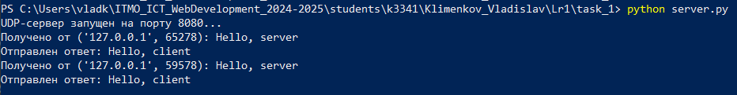
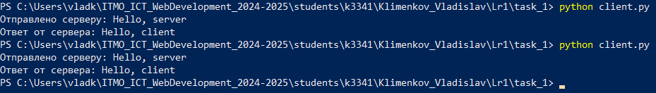

# Задание 1

## Описание задания

Реализовать клиентскую и серверную часть приложения. Клиент отправляет серверу сообщение «Hello, server», и оно должно отобразиться на стороне сервера. В ответ сервер отправляет клиенту сообщение «Hello, client», которое должно отобразиться у клиента.

**Требования:**

- Обязательно использовать библиотеку `socket`.
- Реализовать с помощью протокола UDP.

## Решение

### Листинг

**server.py**

```python
import socket

# Создаём сокет сервера для UDP-подключения
server_socket = socket.socket(socket.AF_INET, socket.SOCK_DGRAM)

# Запускаем сервер на localhost
server_socket.bind(('localhost', 8080))
print("UDP-сервер запущен на порту 8080...")

# Запускаем цикл работы сервера
while True:

    # Получаем UDP-запрос от клиента
    data, client_address = server_socket.recvfrom(1024)
    message = data.decode()
    print(f'Получено от {client_address}: {message}')

    # Посылаем UDP-ответ клиенту
    response = 'Hello, client'
    server_socket.sendto(response.encode(), client_address)
    print(f'Отправлен ответ: {response}')
```

**client.py**

```python
import socket

# Создаём  сокет клиента для UDP-подключения
client_socket = socket.socket(socket.AF_INET, socket.SOCK_DGRAM)

# Адрес сервера
server_address = ('localhost', 8080)

# Отправляем запрос серверу
message = 'Hello, server'
client_socket.sendto(message.encode(), server_address)
print(f'Отправлено серверу: {message}')

# Получаем ответ от сервера
response, server = client_socket.recvfrom(1024)
print(f'Ответ от сервера: {response.decode()}')

# Закрываем сокет
client_socket.close()
```

### Скриншоты

**Сервер**



**Клиент**


