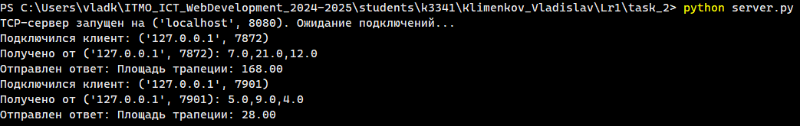
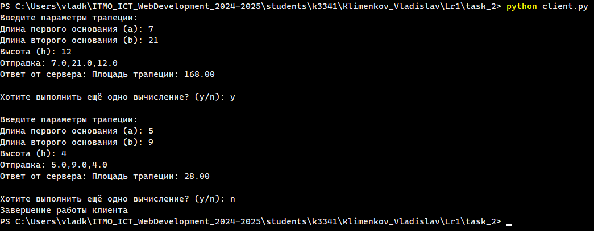

# Задание 2

## Описание задания

Реализовать клиентскую и серверную часть приложения. Клиент запрашивает выполнение математической операции, параметры которой вводятся с клавиатуры. Сервер обрабатывает данные и возвращает результат клиенту.

**Выбранная операция:**

Поиск площади трапеции.

**Требования:**

- Обязательно использовать библиотеку `socket`.
- Реализовать с помощью протокола TCP.

## Решение

### Листинг

**server.py**

```python
import socket

def calculate_trapezoid_area(a, b, h):
    """
    Функция для нахождения площади трапеции.
    """
    return ((a + b) / 2) * h

def main():
    # Создаём сокет сервера для TCP-соединений
    server_socket = socket.socket(socket.AF_INET, socket.SOCK_STREAM)

    # Запускаем сервер на localhost
    server_address = ('localhost', 8080)
    server_socket.bind(server_address)

    # Устанавливаем максимальный размер очереди подключений
    server_socket.listen(5)

    print(f"TCP-сервер запущен на {server_address}. Ожидание подключений...")

    # Цикл работы сервера с отловом ошибок
    try:
        while True:
            # При подключении создаём сокет клиента
            client_socket, client_address = server_socket.accept()
            print(f"Подключился клиент: {client_address}")

            # Декодируем запрос клиента
            data = client_socket.recv(1024).decode()
            print(f"Получено от {client_address}: {data}")

            # Рассчитываем площадь трапеции и подготавливаем ответ
            try:
                a, b, h = map(float, data.split(','))
                response = ""
                if (a <= 0) or (b <= 0) or (h <= 0):
                    response = "Ошибка: a,b,h должны быть положительными числами"
                else:
                    area = calculate_trapezoid_area(a, b, h)
                    response = f"Площадь трапеции: {area:.2f}"

            # В случае ошибки передаём её в качестве ответа
            except Exception as e:
                response = f"Ошибка при вычислении: {str(e)}"
            
            # Отправляем ответ
            client_socket.send(response.encode())
            print(f"Отправлен ответ: {response}")
            
            # Закрываем клиентский сокет
            client_socket.close()

    # Отлавливаем ошибки
    except Exception as e:
        print(f"\nВозникла ошибка: {str(e)}")
    finally:
        # При завершении работы закрываем сокет сервера
        server_socket.close()

if __name__ == "__main__":
    main()
```

**client.py**

```python
import socket


def get_user_input():
    """
    Функция для запроса у пользователя данных трапеции.
    """
    print("Введите параметры трапеции:")
    try:
        a = float(input("Длина первого основания (a): "))
        b = float(input("Длина второго основания (b): "))
        h = float(input("Высота (h): "))
        return f"{a},{b},{h}"
    except ValueError:
        print("Ошибка: Некорректный ввод (нужно ввести числовые значения)!")
        return None


def send_request(server_address, data, timeout=5.0):
    """
    Функция для отправки запроса на сервер и получения ответа.
    """
    try:
        # Устанавливаем соединение с сервером, отправляем запрос и получаем ответ
        # (Также используем timeout для ограничения времени ожидания соединения)
        with socket.create_connection(server_address, timeout=timeout) as s:
            s.sendall(data.encode())
            resp = s.recv(1024).decode(errors='replace')
            return resp
    except Exception as e:
        return f"Ошибка соединения: {e}"


def main():
    server_address = ('localhost', 8080)

    try:
        # Цикл взаимодействия клиента с пользователем
        # (Запросить данные, отправить серверу, получить и вывести ответ)
        while True:
            data = get_user_input()
            if data is None:
                continue

            print(f"Отправка: {data}")
            response = send_request(server_address, data)
            print(f"Ответ от сервера: {response}")

            choice = input("\nХотите выполнить ещё одно вычисление? (y/n): ").strip().lower()
            if choice != 'y':
                print("Завершение работы клиента")
                break
            print()
    
    except Exception as e:
        print(f"\nВозникла ошибка: {e}")


if __name__ == "__main__":
    main()
```

### Скриншоты

**Сервер**



**Клиент**


