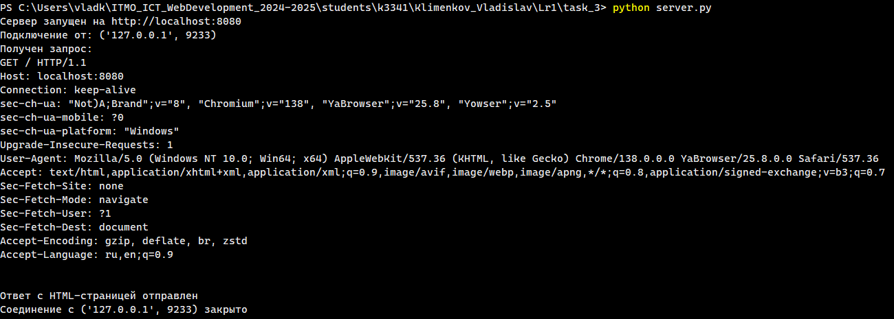
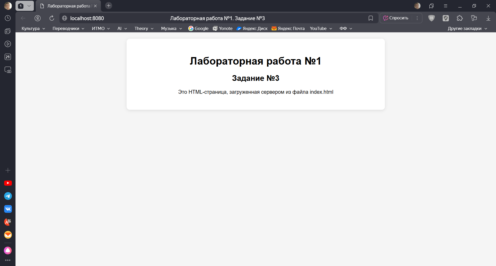

# Задание 3

## Описание задания

Реализовать серверную часть приложения. Клиент подключается к серверу, и в ответ получает HTTP-сообщение, содержащее HTML-страницу, которая сервер подгружает из файла `index.html`.

**Требования:**

- Обязательно использовать библиотеку `socket`.

## Решение

### Листинг

**server.py**

```python
import socket


def main():
    host = 'localhost'
    port = 8080

    # Создаём сокет сервера и оптимизируем его для отладки
    server_socket = socket.socket(socket.AF_INET, socket.SOCK_STREAM)
    server_socket.setsockopt(socket.SOL_SOCKET, socket.SO_REUSEADDR, 1)

    try:
        # Запускаем сервер на localhost
        server_socket.bind((host, port))
        server_socket.listen(5)
        print(f"Сервер запущен на http://{host}:{port}")

        # Запускаем цикл работы с запросами
        while True:
            # Получаем запрос от клиента (браузера)
            client_socket, client_address = server_socket.accept()
            print(f"Подключение от: {client_address}")

            # Устанавливаем максимальное время соединения,
            # чтобы избежать "висящих" сокетов
            # (При истечении заданного времени выдаст ошибку)
            client_socket.settimeout(5.0)

            try:
                # Декодируем запрос
                request = client_socket.recv(1024).decode('utf-8')
                print(f"Получен запрос:\n{request}")

                # Заголовок ответа
                response_headers = [
                    "HTTP/1.1 200 OK",
                    "Content-Type: text/html; charset=utf-8",
                    "Connection: close"
                ]

                # Считываем содержимое HTML-файла "index.html"
                with open('index.html', 'r', encoding='utf-8') as file:
                    html_content = file.read()
                
                # Формируем и отправляем ответ
                response = "\r\n".join(response_headers) + "\r\n\r\n" + html_content
                client_socket.sendall(response.encode('utf-8'))
                print("Ответ с HTML-страницей отправлен")
            
            # Отлавливаем ошибки (в том числе и "socket.timeout")
            except socket.timeout:
                    print(f"Таймаут при чтении данных от {client_address}")
            except Exception as e:
                print(f"Ошибка при обработке запроса: {e}")
            finally:
                # Закрываем соединение с клиентом
                client_socket.close()
                print(f"Соединение с {client_address} закрыто\n")
    
    except Exception as e:
        print(f"Ошибка сервера: {e}")
    finally:
        server_socket.close()


if __name__ == "__main__":
    main()
```

**index.html**

```html
<!DOCTYPE html>
<html lang="ru">
<head>
    <meta charset="UTF-8">
    <meta name="viewport" content="width=device-width, initial-scale=1.0">
    <title>Лабораторная работа №1. Задание №3</title>
    <style>
        body {
            font-family: Arial, sans-serif;
            max-width: 800px;
            margin: 0 auto;
            padding: 20px;
            background-color: #f5f5f5;
            text-align: center;
        }
        .container {
            background: white;
            padding: 30px;
            border-radius: 10px;
            box-shadow: 0 2px 10px rgba(0,0,0,0.1);
        }
    </style>
</head>
<body>
    <div class="container">
        <h1>Лабораторная работа №1</h1>
        <h2>Задание №3</h2>
        <p>Это HTML-страница, загруженная сервером из файла index.html</p>
    </div>
</body>
</html>
```

### Скриншоты

**Сервер**



**Браузер**


