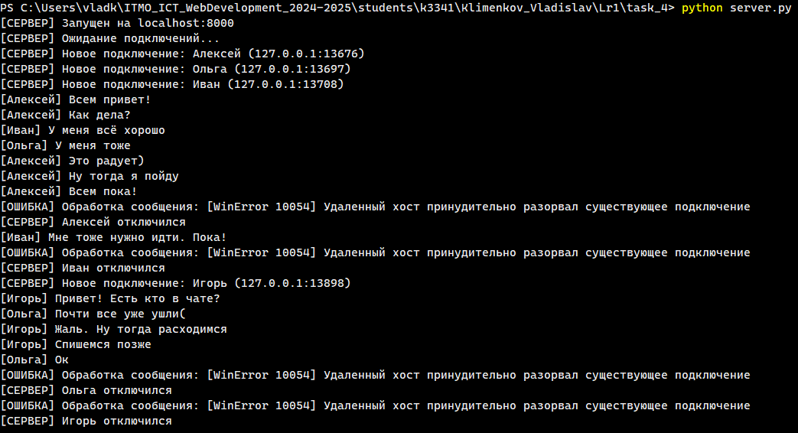
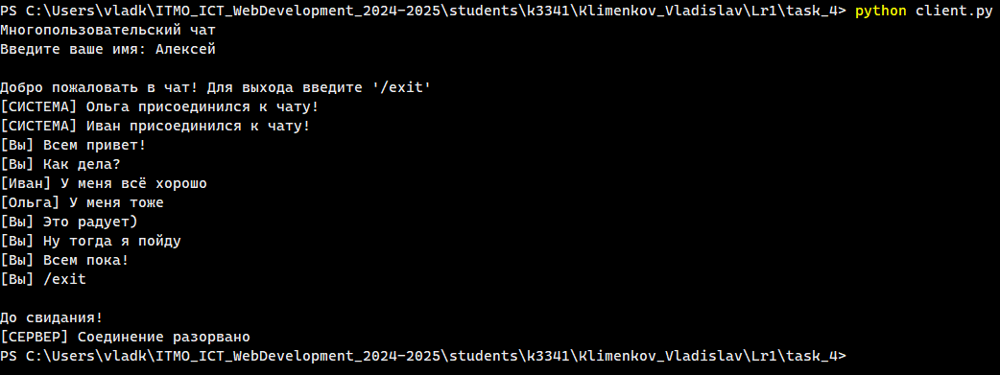
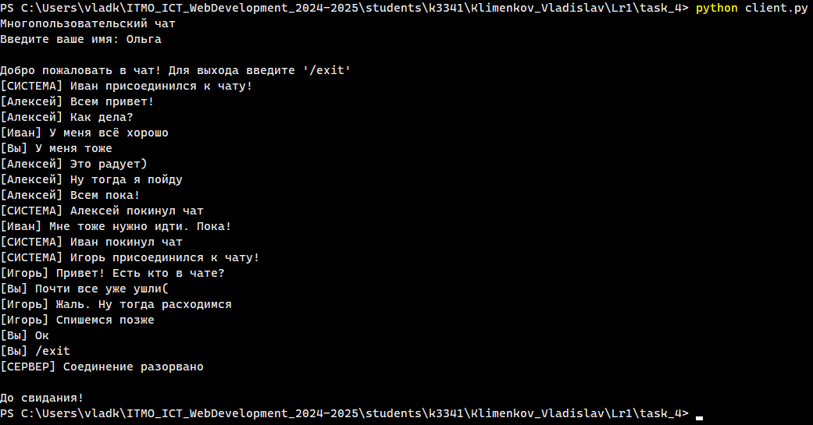
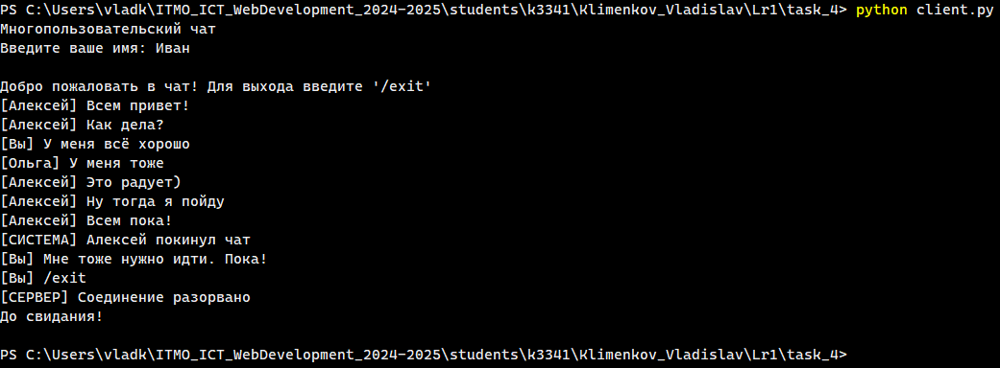
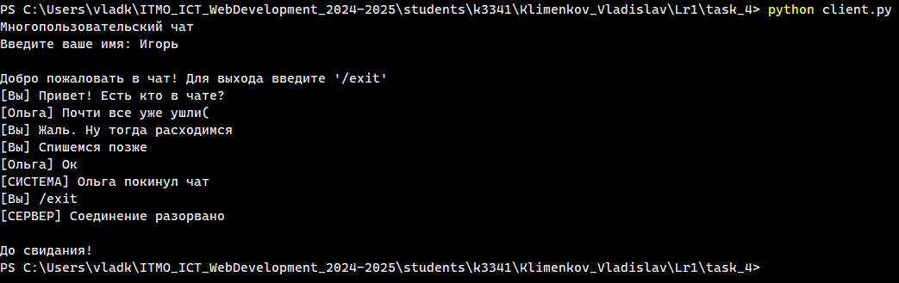

# Задание 4

## Описание задания

Реализовать двухпользовательский или многопользовательский чат. Для максимального количества баллов реализуйте многопользовательский чат.

**Требования:**

- Обязательно использовать библиотеку `socket`.
- Для многопользовательского чата необходимо использовать библиотеку `threading`.

**Реализация:**

- Протокол TCP: 100% баллов.
- Протокол UDP: 80% баллов.
- Для UDP используйте threading для получения сообщений на клиенте.
- Для TCP запустите клиентские подключения и обработку сообщений от всех пользователей в потоках. Не забудьте сохранять пользователей, чтобы отправлять им сообщения.

## Решение

Для реализации был выбран вариант с многопользовательским чатом, использующим протокол TCP и библиотеку `threading` для обработки сообщений от пользователей в отдельных потоках.

### Листинг

**server.py**

```python
import socket
import threading


class Client:
    """
    Класс для реализации клиента.
    Каждый клиент имеет свой сокет, адрес и имя пользователя.
    """
    def __init__(self, socket, address, username=None):
        self.socket = socket
        self.address = address
        self.username = username


class ChatServer:
    """
    Класс для реализации многопользовательского чата.
    """
    def __init__(self, host='localhost', port=8000):
        self.host = host
        self.port = port

        # Список для хранения клиентов (пользователей чата)
        self.clients: list[Client] = []

        # Инициализируем сокет сервера
        self.server_socket = socket.socket(socket.AF_INET, socket.SOCK_STREAM)
        self.server_socket.setsockopt(socket.SOL_SOCKET, socket.SO_REUSEADDR, 1)

    def broadcast(self, message: str, sender: Client=None):
        """
        Рассылка сообщения всем пользователям (кроме отправителя).
        """
        for client in self.clients:
            if client != sender:
                try:
                    client.socket.send(message.encode('utf-8'))
                except:
                    # При возникновении ошибки при отправке сообщения, удаляем клиента
                    self.remove_client(client)
    
    def remove_client(self, client: Client):
        """
        Удаление клиента из чата.
        """
        if client in self.clients:
            self.clients.remove(client)
            print(f"[СЕРВЕР] {client.username} отключился")
            self.broadcast(f"[СИСТЕМА] {client.username} покинул чат", client)
            client.socket.close()
    
    def handle_client(self, client: Client):
        """
        Обработка сообщений от конкретного клиента.
        """
        try:
            # Первое сообщение должно содержать имя пользователя
            username = client.socket.recv(1024).decode('utf-8')
            if not username:
                return
            client.username = username

            print(f"[СЕРВЕР] Новое подключение: {client.username} ({client.address[0]}:{client.address[1]})")
            self.broadcast(f"[СИСТЕМА] {client.username} присоединился к чату!", client)

            # Обработка сообщений клиента, отправляемых в чат
            while True:
                try:
                    # Получаем сообщение от клиента и рассылаем его остальным пользователям чата
                    message = client.socket.recv(1024).decode('utf-8')
                    if not message:
                        break
                    print(f"[{client.username}] {message}")
                    self.broadcast(f"[{client.username}] {message}", client)
                
                except Exception as e:
                    print(f"[ОШИБКА] Обработка сообщения: {e}")
                    break
        
        except Exception as e:
            print(f"[ОШИБКА] Обработка клиента: {e}")
        finally:
            # При завершении работы с клиентом, удаляем его
            self.remove_client(client)
    
    def start(self):
        """
        Запуск сервера.
        """
        # Подключаем сервер к localhost
        self.server_socket.bind((self.host, self.port))
        self.server_socket.listen(10)
        print(f"[СЕРВЕР] Запущен на {self.host}:{self.port}")
        print("[СЕРВЕР] Ожидание подключений...")

        try:
            # Цикл приёма подключений от клиента
            while True:
                # Получаем подключение от клиента
                socket, address = self.server_socket.accept()
                client = Client(socket, address)
                self.clients.append(client)

                # Запускаем обработку сообщений клиента в отдельном потоке
                client_thread = threading.Thread(target=self.handle_client, args=(client,))
                client_thread.daemon = True
                client_thread.start()
            
        except Exception as e:
            print(f"[ОШИБКА] Работа сервера: {e}")
        finally:
            # Очищаем список клиентов и закрываем сокет сервера
            for client in self.clients.copy():
                client.socket.close()
            self.server_socket.close()


if __name__ == "__main__":
    server = ChatServer()
    server.start()
```

client.py

```python
import socket
import threading


class ChatClient:
    """
    Консольный клиент для реализации интерфейса чата в консоли пользователя.
    """
    def __init__(self, host='localhost', port=8000):
        self.host = host
        self.port = port
        self.client_socket = socket.socket(socket.AF_INET, socket.SOCK_STREAM)
        self.running = True
    
    def receive_messages(self):
        """
        Получение сообщений от сервера.
        """
        while self.running:
            try:
                # Получаем сообщение от сервера и выводим его пользователю
                message = self.client_socket.recv(4096).decode('utf-8')
                if message:
                    # Задаём дополнительные параметры print для удобства отображения интерфейса чата
                    print(f"\r{message}\n[Вы] ", end="", flush=True)
            except:
                # При ошибке считаем соединение разорваны и завершаем работу клиента
                print("\r[СЕРВЕР] Соединение разорвано")
                self.running = False
                break
    
    def send_message(self, message):
        """
        Отправка сообщения на сервер.
        """
        try:
            self.client_socket.send(message.encode('utf-8'))
        except:
            print("[ОШИБКА] Не удалось отправить сообщение")
    
    def start(self):
        """
        Запуск консольного клиента.
        """
        print("Многопользовательский чат")
        username = input("Введите ваше имя: ")
        
        try:
            self.client_socket.connect((self.host, self.port))

            # Первым сообщением отправляем имя пользователя
            self.send_message(username)

            # Запускаем приём сообщений от сервера в отдельном потоке
            receive_thread = threading.Thread(target=self.receive_messages)
            receive_thread.daemon = True
            receive_thread.start()

            print("\nДобро пожаловать в чат! Для выхода введите '/exit'")
            print("[Вы] ", end="")

            # Цикл для отправки сообщений пользователя
            while self.running:
                try:
                    message = input()
                    if message.strip() == '/exit':
                        self.running = False
                        break
                    if message.strip():
                        self.send_message(message)
                    print("[Вы] ", end="")

                except Exception as e:
                    print(f"[ОШИБКА] {e}")
                    break
        
        except Exception as e:
            print(f"[ОШИБКА] {e}")
        finally:
            self.running = False
            self.client_socket.close()
            print("\nДо свидания!")


if __name__ == "__main__":
    client = ChatClient()
    client.start()
```

### Скриншоты

Для проверки работы чата использовались одно окна терминала для запуска сервера и четыре окна терминала для симуляции четырёх отдельных пользователей.

**Сервер**



**Пользователь №1**



**Пользователь №2**



**Пользователь №3**



**Пользователь №4**


