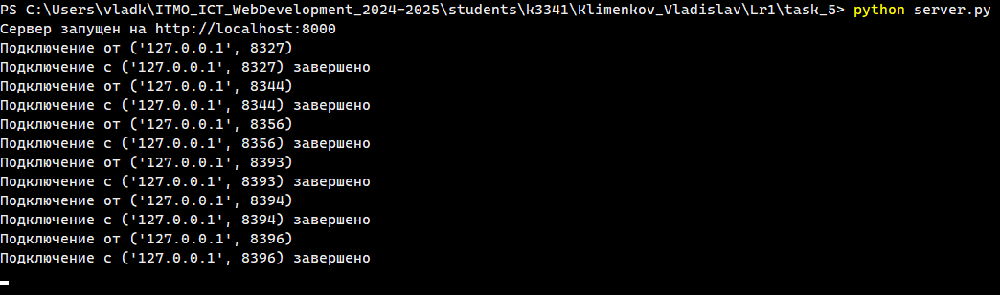
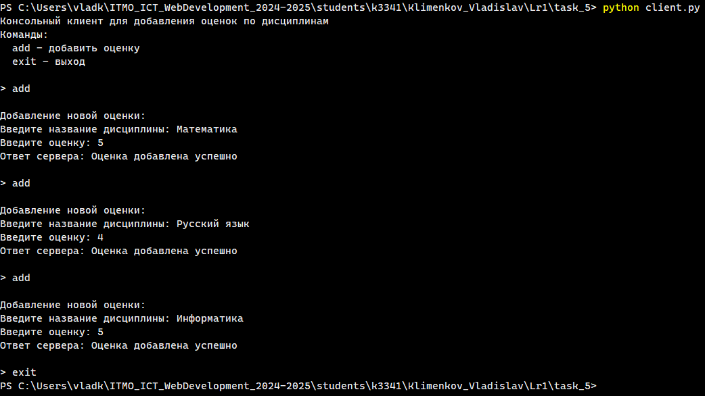
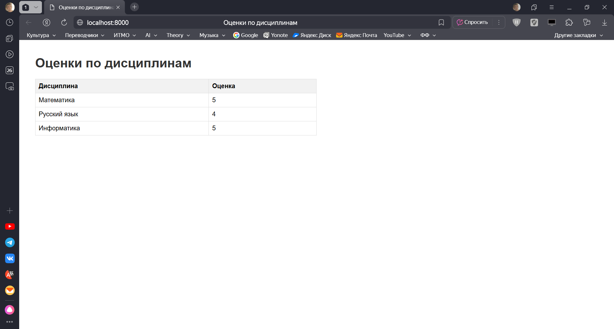

# Задание 5

## Описание задания

Написать простой веб-сервер для обработки GET и POST HTTP-запросов с помощью библиотеки `socket` в Python.

**Задание:**

- Сервер должен:
    1. Принять и записать информацию о дисциплине и оценке по дисциплине.
    2. Отдать информацию обо всех оценках по дисциплинам в виде HTML-страницы.

## Решение

### Листинг

**server.py**

```python
import socket
from urllib.parse import parse_qs


class GradeHTTPServer:
    """
    Сервер для работы с оценками по дисциплинам.
    """
    def __init__(self, host='localhost', port=8000):
        self.host = host
        self.port = port
        self.grades: dict[str, int] = {}

    def start(self):
        """
        Запуск сервера.
        """
        # Запускаем сервер на localhost
        server_socket = socket.socket(socket.AF_INET, socket.SOCK_STREAM)
        server_socket.setsockopt(socket.SOL_SOCKET, socket.SO_REUSEADDR, 1)
        server_socket.bind((self.host, self.port))
        server_socket.listen(5)

        print(f"Сервер запущен на http://{self.host}:{self.port}")

        try:
            # Цикл обработки запросов от клиента
            while True:
                # Получаем запрос от клиента
                client_socket, client_address = server_socket.accept()
                print(f"Подключение от {client_address}")

                # Задаём максимальное время соединения, чтобы избежать зависших сокетов
                client_socket.settimeout(5.0)

                # Обрабатываем запрос клиента и отправляем ответ
                try:
                    request_data = client_socket.recv(1024).decode('utf-8')
                    if request_data:
                        response = self.handle_request(request_data)
                        client_socket.sendall(response.encode('utf-8'))
                except socket.timeout:
                    print(f"Таймаут при чтении данных от {client_address}")
                except Exception as e:
                    print(f"Ошибка при обработке запроса от {client_address}: {e}")
                finally:
                    client_socket.close()
                    print(f"Подключение с {client_address} завершено")

        except Exception as e:
            print(f"Ошибка сервера: {e}")
        finally:
            server_socket.close()
    
    def handle_request(self, request_data):
        """
        Обработка запроса клиента.
        """
        # Разбиваем запрос на строки
        lines = request_data.split('\r\n')
        if not lines:
            return self.create_response(400, "Bad Request")
        
        # Извлекаем из спроса метод
        request_line = lines[0]
        parts = request_line.split()
        method = parts[0]

        # Обрабатываем GET-запрос
        if method == 'GET':
            return self.create_html_response()
        
        # Обрабатываем POST-запрос
        elif method == 'POST':
            # Извлекаем и передаём для обработки тело запроса
            body = ''
            for i, line in enumerate(lines):
                if line == '':
                    body = '\r\n'.join(lines[i+1:])
                    break
            return self.handle_post(body)
        # Сообщение об ошибки, если не удалось распознать метод
        else:
            return self.create_response(405, "Method Not Allowed")
    
    def handle_post(self, body):
        """
        Обработка POST-запроса.
        """
        try:
            # Извлекаем название дисциплины и оценку за неё
            params = parse_qs(body)
            discipline = params.get('discipline', [''])[0]
            grade = params.get('grade', [''])[0]
            
            # Помещаем дисциплину и оценку в словарь
            if discipline and grade:
                self.grades[discipline] = grade
                return self.create_response(200, "OK", "Оценка добавлена успешно")
            else:
                return self.create_response(400, "Bad Request: Missing parameters")
        except Exception as e:
                return self.create_response(400, f"Bad Request: {str(e)}")

    def create_response(self, status_code, message, content='', content_type='text/plain'):
        """
        Формирует ответ для отправки клиенту.
        """
        # Формируем заголовок ответа и добавляем к нему заданное содержание (тело ответа)
        response = f"HTTP/1.1 {status_code} {message}\r\n"
        response += "Content-Type: {}\r\n".format(content_type)
        response += "Content-Length: {}\r\n".format(len(content.encode('utf-8')))
        response += "Connection: close\r\n"
        response += "\r\n"
        response += content
        return response

    def create_html_response(self):
        """
        Формирует HTML-страницу с оценками по всем дисциплинам.
        """
        html = """<!DOCTYPE html>
<html>
<head>
    <title>Оценки по дисциплинам</title>
    <meta charset="utf-8">
    <style>
        body { font-family: Arial, sans-serif; margin: 40px; }
        h1 { color: #333; }
        table { border-collapse: collapse; width: 50%; margin: 20px 0; }
        th, td { border: 1px solid #ddd; padding: 8px; text-align: left; }
        th { background-color: #f2f2f2; }
    </style>
</head>
<body>
    <h1>Оценки по дисциплинам</h1>"""
        
        # Если оценки есть
        if self.grades:
            html += "<table>"
            html += "<tr><th>Дисциплина</th><th>Оценка</th></tr>"
            for discipline, grade in self.grades.items():
                html += f"<tr><td>{discipline}</td><td>{grade}</td></tr>"
            html += "</table>"
        
        # Если оценок нет
        else:
            html += "<p>Оценок пока нет</p>"
        
        html += "</body></html>"
        
        return self.create_response(200, "OK", html, 'text/html; charset=utf-8')


if __name__ == "__main__":
    server = GradeHTTPServer()
    server.start()
```

**client.py**

```python
import requests


class GradeClient:
    """
    Клиента для отправки POST-запросов с оценками по дисциплинам.
    """
    def __init__(self, base_url='http://localhost:8000'):
        self.base_url = base_url
    
    def add_grade(self, discipline, grade):
        """
        Формирует и отправляет POST-запрос серверу с оценкой по дисциплиной
        и выводит ответ от сервера в консоль.
        """
        data = {
            'discipline': discipline,
            'grade': grade
        }
        try:
            response = requests.post(f"{self.base_url}", data=data)
            response.encoding = 'utf-8'
            print(f"Ответ сервера: {response.text}")
        except Exception as e:
            print(f"Ошибка: {e}")

def main():
    """
    Main-функция с реализацией консольного клиента для отправки оценок по дисциплинам.
    """
    client = GradeClient()
    print("Консольный клиент для добавления оценок по дисциплинам")
    print("Команды:")
    print("  add - добавить оценку")
    print("  exit - выход")
    print()

    # Цикл работы консольного клиента
    while True:
        try:
            # Запрашиваем команду
            command = input("> ").strip()
            if not command:
                continue

            # Запрашиваем дисциплину и оценку и отправляем их на сервер
            if command == 'add':
                print("\nДобавление новой оценки:")
                discipline = input("Введите название дисциплины: ").strip()
                grade = input("Введите оценку: ").strip()
                if discipline and grade:
                    client.add_grade(discipline, grade)
                else:
                    print("Ошибка: Все поля должны быть заполнены")
                print()

            elif command == 'exit':
                break
            else:
                print("Неизвестная команда.")
        
        except Exception as e:
            print(f"Ошибка: {e}")

if __name__ == "__main__":
    main()
```

### Скриншоты

**Сервер**



**Консольный клиент**



**Браузер**


