# Лабораторная работа №2

## Цель 

Овладеть практическими навыками и умениями реализации web-сервисов средствами Django.

## Практическое задание

Реализовать сайт используя фреймворк Django и СУБД PostgreSQL, в соответствии с вариантом задания лабораторной работы.

## Вариант

**5. Список научных конференций**

Интерфейс описывает названия конференций, список тематик, место проведения, период проведения, описание конференций, описание место проведения, условия участия.

Необходимо реализовать следующий функционал:

- Регистрация новых пользователей.
- Просмотр конференций и регистрацию авторов для выступлений. Пользователь должен иметь возможность редактирования и удаления своих регистраций.
- Написание отзывов к конференциям. При добавлении комментариев, должны сохраняться даты конференции, текст комментария, рейтинг (1-10), информация о комментаторе.
- Администратор должен иметь возможность указания результатов выступления (рекомендован к публикации или нет) средствами Django-admin.
- В клиентской части должна формироваться таблица, отображающая всех участников по конференциям.

## Выполнение

Для выполнения задания был создан Django-проект `scientific_conferences_list`, в котором были созданы Django-приложения `users` и `conferences`, реализующие следующий функционал:

- `users`: Работа с пользователями (регистрация, авторизация, выход из аккаунта, изменение данных пользователя и т.п.).
- `conferences`: Работа с конференциями, выступлениями и отзывами (создание, редактирование, удаление и т.п.).

Далее пройдёмся по всем пунктам с требованиями из задания и кратко рассмотрим их реализацию.

> Интерфейс описывает названия конференций, список тематик, место проведения, период проведения, описание конференций, описание место проведения, условия участия.

Для реализации интерфейса с информацией о конференции в первую очередь была создана модель конференции:

```python title="scientific_conferences_list/conferences/models.py"
class Conference(models.Model):
    name = models.CharField(max_length=255)
    description = models.TextField(blank=True)
    start_date = models.DateField()
    end_date = models.DateField()
    topics = models.CharField(max_length=255, blank=True)
    participation_conditions = models.TextField(blank=True)
    venue_name = models.CharField(max_length=255)
    venue_description = models.TextField(blank=True)

    class Meta:
        ordering = ['start_date']

    def __str__(self):
        return f'{self.name} ({self.start_date} - {self.end_date})'
```

Далее были реализованы представления для отображения страницы со списком всех конференций и страницы с детальной информацией о конференции:

```python title="scientific_conferences_list/conferences/views.py"
class ConferencesListView(LoginRequiredMixin, ListView):
    model = Conference
    template_name = 'conferences/conferences_list.html'
    context_object_name = 'conferences'
    paginate_by = 10


class ConferenceDetailView(LoginRequiredMixin, DetailView):
    model = Conference
    template_name = 'conferences/conference_detail.html'
    context_object_name = 'conference'

    def get_context_data(self, **kwargs):
        context = super().get_context_data(**kwargs)
        conference = self.object
        user_presentations = Presentation.objects.filter(
            conference=conference, 
            author=self.request.user
        )
        context['user_presentations'] = user_presentations
        return context
```

Представления были подключены к соответствующим URL-адресам:

```python title="scientific_conferences_list/scientific_conferences_list/urls.py"
urlpatterns = [
    path('admin/', admin.site.urls),

    # Создание URL-разделов для приложений "users" и "conferences"
    path('users/', include('users.urls')),
    path('conferences/', include('conferences.urls')),

    path('', root_redirect, name='root_redirect')
]
```

```python title="scientific_conferences_list/conferences/urls.py"
# Настройка URLs для самих представлений
urlpatterns = [
     path('list/', ConferencesListView.as_view(), name='conferences_list'),
     path('<int:pk>/', ConferenceDetailView.as_view(), name='conference_detail'),
]
```

Также были созданы соответствующие HTML-шаблоны, к которым были подключены стили из `scientific_conferences_list/static/css`:

```html title="scientific_conferences_list/templates/conferences/conferences_list.html"

<!DOCTYPE html>
<html>
<head>
    <meta charset="utf-8">
    <title>Список научных конференций</title>
    <link rel="stylesheet" type="text/css" href="">
</head>
<body>
    

    <h1 class="mt-20">Список научных конференций</h1>

    
    <a class="blue-button mt-20" href="">
        Добавить конференцию
    </a>
    

    <!-- Список конференций -->
    <div class="conferences-list mt-20">
        

        <!-- Карточка конференции -->
        <div class="conference-card mb-10">
            <h2>{{ conference.name }}</h2>
            <p><strong>Даты:</strong> {{ conference.start_date }} - {{ conference.end_date }}</p>
            <p><strong>Место:</strong> {{ conference.venue_name }}</p>
            <p><strong>Темы:</strong> {{ conference.topics | default:"Не указаны" }}</p>
            <div class="flex">
                <a href="">Подробнее</a>
                
                <a href="">Изменить</a>
                <a href="">Удалить</a>
                
            </div>
        </div>
        <br>
        
        <p>Конференций не найдено.</p>
        
    </div>

    
</body>
</html>
```

```html title="scientific_conferences_list/templates/conferences/conference_detail.html"

<!DOCTYPE html>
<html>
<head>
    <meta charset="utf-8">
    <title>{{ conference.name }}</title>
    <link rel="stylesheet" type="text/css" href="">
</head>
<body>
    

    <a href="">← К списку конференций</a>

    <h1 class="mt-15">{{ conference.name }}</h1>

    <a href="" class="blue-button mt-15">
        Зарегистрировать своё выступление
    </a>

    
    <br>
    <div class="card mt-20">
        <h2>Мои выступления:</h2>
        
            <p class="mt-20"><strong>{{presentation.title}}</strong></p>
            <div class="flex">
                <a href="">Подробнее</a>
                <a href="">
                    Изменить
                </a>
                <a href="">
                    Удалить
                </a>
            </div>
        
    </div>
    

    <br>
    <div class="card mt-15 lh16">
        <h2>Список выступлений:</h2>
        <a href="">Все выступления</a>
    </div>

    <br>
    <div class="card mt-15 lh16">
        <h2>Отзывы о конференции:</h2>
        <div class="flex">
            <a href="">Все отзывы</a>
            <a href="">Мои отзывы</a>
            <a href="">Добавить отзыв</a>
        </div>
    </div>

    <br>
    <div class="card mt-15 lh16">
        <h2>Даты проведения:</h2>
        <p>{{ conference.start_date }} - {{ conference.end_date }}</p>
    </div>

    <br>
    <div class="card mt-15 lh16">
        <h2>Место проведения:</h2>
        <p>{{ conference.venue_name | default:"Не указано" }}</p>
    </div>

    <br>
    <div class="card mt-15 lh16">
        <h2>Описание:</h2>
        <p>{{ conference.description | default:"Не указано" }}</p>
    </div>

    <br>
    <div class="card mt-15 lh16">
        <h2>Темы:</h2>
        <p>{{ conference.topics | default:"Не указаны" }}</p>
    </div>

    <br>
    <div class="card mt-15 lh16">
        <h2>Условия участия:</h2>
        <p>{{ conference.participation_conditions | default:"Не указаны" }}</p>
    </div>

    <br>
    <div class="card mt-15 lh16">
        <h2>Описание места проведения:</h2>
        <p>{{ conference.venue_description | default:"Не указано" }}</p>
    </div>
</body>
</html>
```

В результате были реализованы следующие страницы:

Страница со списком всех конференций:

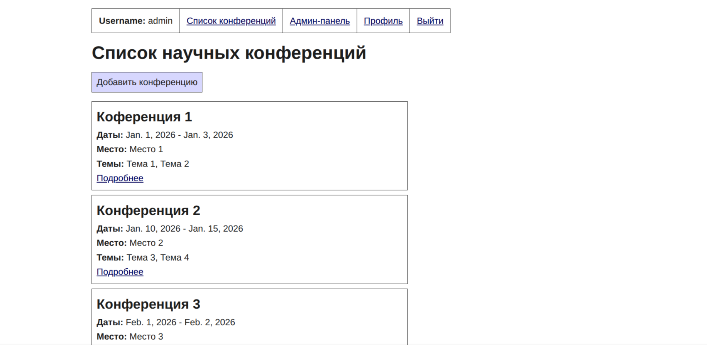

Страница с детальной информацией о конференции:

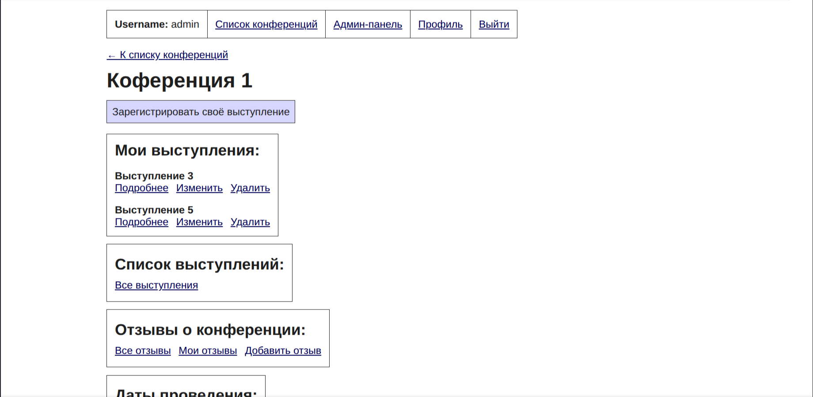

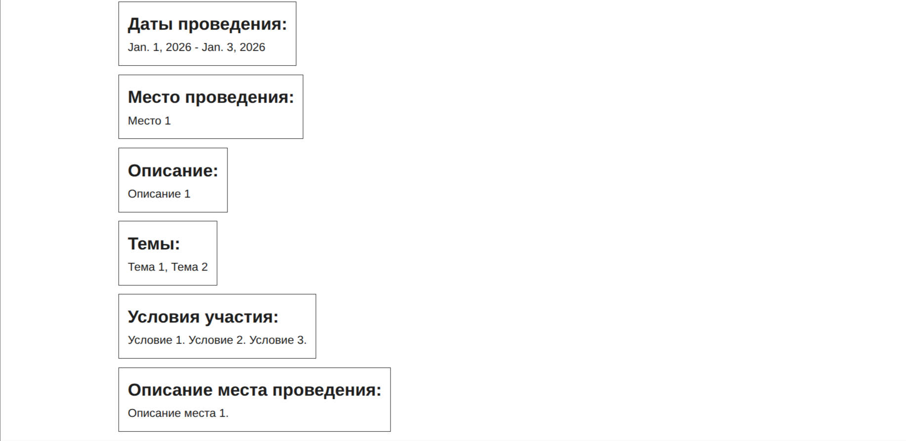

> Регистрация новых пользователей.

Для работы с пользователями в первую очередь была создана соответствующая модель:

```python title="scientific_conferences_list/users/models.py"
class User(AbstractUser):
    def __str__(self):
        return f'{self.username} ({self.get_full_name()})'
```

Для реализации механизма регистрации было создано соответствующее представление:

```python title="scientific_conferences_list/users/views.py"
class CustomSignUpView(CreateView):
    model = User
    form_class = SignUpForm
    template_name = 'users/signup.html'
    success_url = reverse_lazy('login')
```

Представление было подключено к соответствующему URL:

```python title="scientific_conferences_list/users/urls.py"
urlpatterns = [
    path('signup/', CustomSignUpView.as_view(), name='signup'),
]
```

Также был создан соответствующий HTML-шаблон для формы регистрации:

```html title="scientific_conferences_list/templates/users/signup.html"

<!DOCTYPE html>
<html>
<head>
    <meta charset="utf-8">
    <title>Регистрация</title>
    <link rel="stylesheet" type="text/css" href="">
</head>
<body>
    <h1>Регистрация</h1>
    <form method="post" class="form mt-20">
        
        {{ form.as_p }}
        <div class="buttons">
            <button type="submit">Зарегистрироваться</button>
            <a href="javascript:history.back()">Отмена</a>
        </div>
    </form>
</body>
</html>
```

В результате получилась следующая страница регистрации:

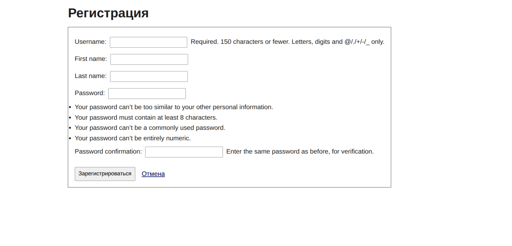

> Просмотр конференций и регистрацию авторов для выступлений. Пользователь должен иметь возможность редактирования и удаления своих регистраций.

Просмотр конференций осуществляется через страницу со списком всех конференций и страницу с детальной информацией о конференции (эти страницы были разобраны выше).

Рассмотрим механизм регистрации выступлений авторов на конференции:

В первую очередь была реализована модель выступления:

```python title="scientific_conferences_list/conferences/models.py"
class Presentation(models.Model):
    RECOMMENDATION_CHOICES = [
        (None, "Не оценено"),
        (True, "Рекомендован"),
        (False, "Не рекомендован"),
    ]

    author = models.ForeignKey(User, on_delete=models.CASCADE)
    conference = models.ForeignKey(Conference, on_delete=models.CASCADE)
    title = models.CharField(max_length=255)
    description = models.TextField(blank=True)
    recommendation = models.BooleanField(choices=RECOMMENDATION_CHOICES, null=True, blank=True)

    def __str__(self):
        return f"{self.title} | {self.author}"
```

Для регистрации выступлений было реализовано следующее представление:

```python title="scientific_conferences_list/conferences/views.py"
class RegisterPresentationView(LoginRequiredMixin, CreateView):
    model = Presentation
    form_class = RegisterPresentationForm
    template_name = 'conferences/presentations/register_presentation.html'

    def get_context_data(self, **kwargs):
        context = super().get_context_data(**kwargs)
        conference = get_object_or_404(Conference, pk=self.kwargs['pk'])
        context['conference'] = conference
        return context

    def form_valid(self, form):
        conference = get_object_or_404(Conference, pk=self.kwargs['pk'])
        presentation = form.save(commit=False)
        presentation.author = self.request.user
        presentation.conference = conference
        presentation.save()
        return super().form_valid(form)

    def get_success_url(self):
        return reverse_lazy('conference_detail', kwargs={'pk': self.kwargs['pk']})
```

Как можно заметить, данное представление дополнительно подгружает в контекст информацию о конференции, на которой должно быть зарегистрировано создаваемое выступление. Также после отправки формы к данным выступления добавляется автор, которым выступает пользователь, создавший выступление.

Данное представление было зарегистрировано в URLs:

```python title=""
urlpatterns = [
     path('<int:pk>/presentations/register',
          RegisterPresentationView.as_view(), 
          name='register_presentation'),
]
```

Также был создан соответствующий HTML-шаблон:

```html title="scientific_conferences_list/templates/conferences/presentations/register_presentation.html"

<!DOCTYPE html>
<html>
<head>
    <meta charset="utf-8">
    <title>Регистрация своего выступления на конференции</title>
    <link rel="stylesheet" type="text/css" href="">
</head>
<body>
    

    <h1 class="mt-15">Регистрация своего выступления на конференции</h1>

    <div class="card lh16 mt-15">
        <p><strong>Конференция:</strong> {{ conference.name }}</p>
        <p><strong>Даты:</strong> {{ conference.start_date }} - {{ conference.end_date }}</p>
        <p><strong>Место:</strong> {{ conference.venue_name }}</p>
    </div>

    <br>
    <form method="post" class="form mt-15">
        
        {{ form.as_p }}
        <div class="buttons">
            <button type="submit">Зарегистрировать</button>
            <a href="javascript:history.back()">Отмена</a>
        </div>
    </form>
</body>
</html>
```

В результате получилась следующая механика регистрации выступлений авторов на конференции:

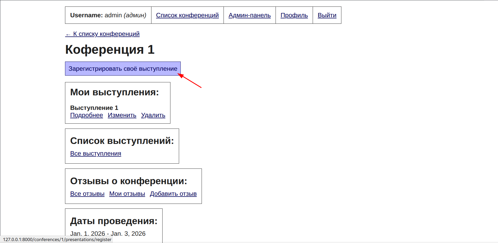

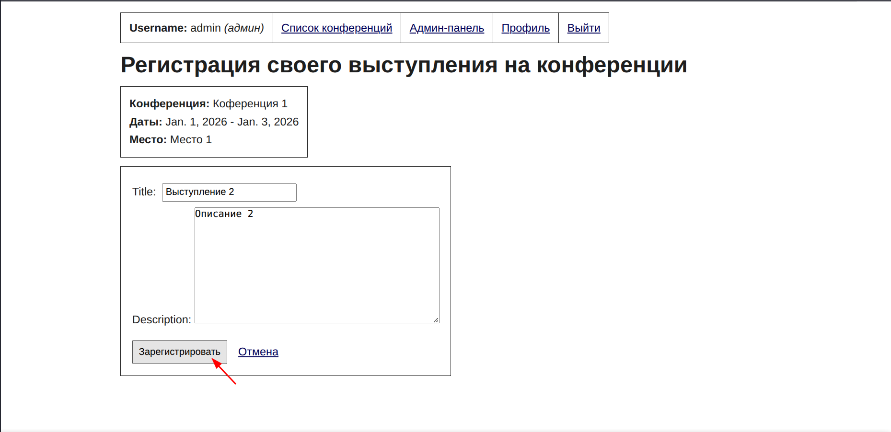

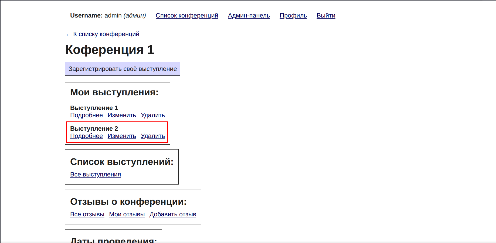

Для редактирования и удаления выступлений были реализованы следующие представления:

```python title="scientific_conferences_list/conferences/views.py"
class EditPresentationView(LoginRequiredMixin, UpdateView):
    model = Presentation
    fields = ['title', 'description']
    template_name = 'conferences/presentations/edit_presentation.html'
    context_object_name = 'presentation'

    def get_object(self, queryset=None):
        presentation = get_object_or_404(Presentation, pk=self.kwargs['presentation_id'])
        if presentation.author != self.request.user:
            raise PermissionDenied("Вы можете изменять только свои выступления")
        return presentation
    
    def get_context_data(self, **kwargs):
        context = super().get_context_data(**kwargs)
        conference = get_object_or_404(Conference, pk=self.kwargs['conference_id'])
        context['conference'] = conference
        return context

    def get_success_url(self):
        return reverse_lazy('conference_detail', kwargs={'pk': self.kwargs['conference_id']})


class CancelPresentationView(LoginRequiredMixin, DeleteView):
    model = Presentation
    template_name = 'conferences/presentations/cancel_presentation.html'
    context_object_name = 'presentation'

    def get_object(self, queryset=None):
        presentation = get_object_or_404(Presentation, pk=self.kwargs['presentation_id'])
        if presentation.author != self.request.user:
            raise PermissionDenied("Вы можете отменять только свои выступления")
        return presentation

    def get_context_data(self, **kwargs):
        context = super().get_context_data(**kwargs)
        conference = get_object_or_404(Conference, pk=self.kwargs['conference_id'])
        context['conference'] = conference
        return context
    
    def get_success_url(self):
        return reverse_lazy('conference_detail', kwargs={'pk': self.kwargs['conference_id']})
```

Как можно заметить, в обоих представлениях проводится проверка на то, что с выступлением работает именно пользователь, создавший его. Если это не так, то выбрасывается ошибка `PermissionDenied`.

Созданные выше представления были зарегистрированы в URLs:

```python title="scientific_conferences_list/conferences/urls.py"
urlpatterns = [
     path('<int:conference_id>/presentations/<int:presentation_id>/cancel',
          CancelPresentationView.as_view(),
          name='cancel_presentation'),
     path('<int:conference_id>/presentations/<int:presentation_id>/edit',
          EditPresentationView.as_view(),
          name='edit_presentation'),
]
```

Также для представлений были созданы соответствующие HTML-шаблоны:

```html title="scientific_conferences_list/templates/conferences/presentations/edit_presentation.html"

<!DOCTYPE html>
<html>
<head>
    <meta charset="utf-8">
    <title>Редактирование своего выступления на конференции</title>
    <link rel="stylesheet" type="text/css" href="">
</head>
<body>
    

    <h1 class="mt-15">Редактирование своего выступления на конференции</h1>

    <div class="card mt-15 lh16">
        <p><strong>Конференция:</strong> {{ conference.name }}</p>
        <p><strong>Даты:</strong> {{ conference.start_date }} - {{ conference.end_date }}</p>
        <p><strong>Место:</strong> {{ conference.venue_name }}</p>
    </div>

    <br>
    <form method="post" class="form mt-15">
        
        {{ form.as_p }}
        <div class="buttons">
            <button type="submit">Сохранить</button>
            <a href="javascript:history.back()">Отмена</a>
        </div>
    </form>
</body>
</html>
```

```html title="scientific_conferences_list/templates/conferences/presentations/cancel_presentation.html"

<!DOCTYPE html>
<html>
<head>
    <meta charset="utf-8">
    <title>Отмена выступления на конференции</title>
    <link rel="stylesheet" type="text/css" href="">
</head>
<body>
    

    <h1 class="mt-15">Отменить ваше выступление на конференции?</h1>

    <div class="card mt-15 lh16">
    <p><strong>Выступление:</strong> {{ presentation.title }}</p>
    <p><strong>Конференция:</strong> {{ conference.name }}</p>
    <p><strong>Даты:</strong> {{ conference.start_date }} - {{ conference.end_date }}</p>
    <p><strong>Место:</strong> {{ conference.venue_name }}</p>
    </div>

    <br>
    <form method="post" class="form mt-15">
        
        <div class="flex">
            <button type="submit">Да</button>
            <a href="javascript:history.back()">Нет</a>
        </div>
    </form>
</body>
</html>
```

В результате получились следующие механизмы редактирования и удаления выступлений:

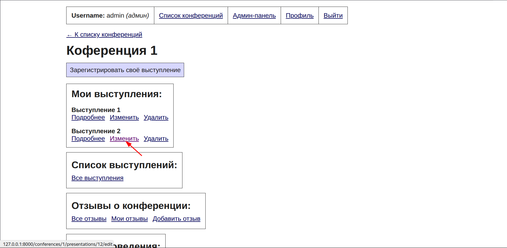

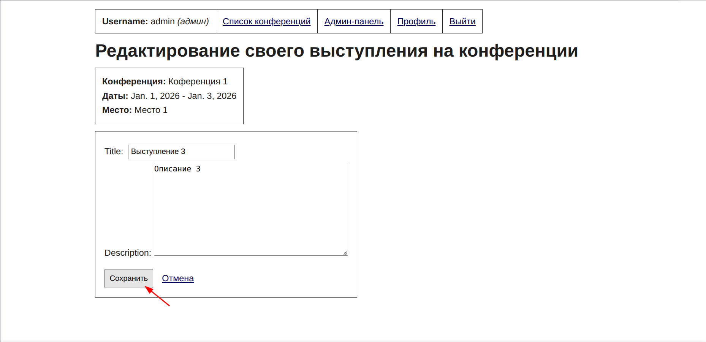

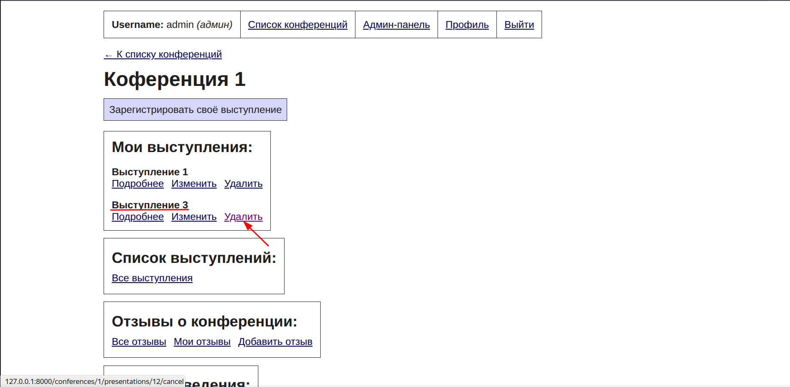

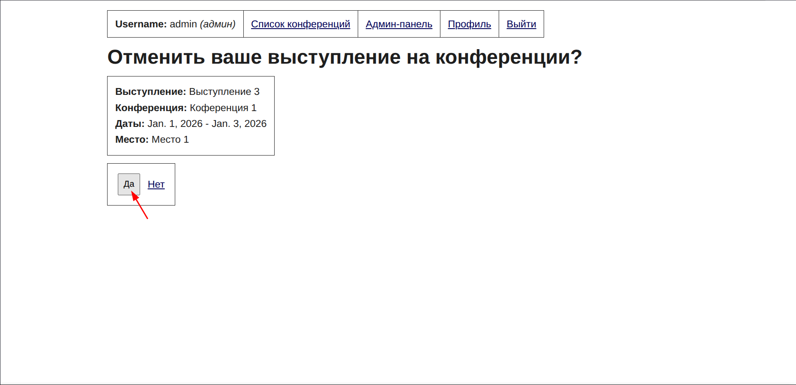

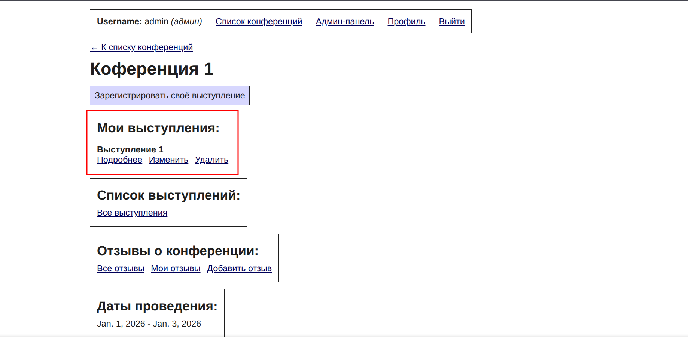

> Написание отзывов к конференциям. При добавлении комментариев, должны сохраняться даты конференции, текст комментария, рейтинг (1-10), информация о комментаторе.

Для работы с комментариями в первую очередь была создана модель комментария:

```python title="scientific_conferences_list/conferences/models.py"
class Review(models.Model):
    RATING_CHOICES = [(i, str(i)) for i in range(1, 11)]

    user = models.ForeignKey(User, on_delete=models.CASCADE)
    conference = models.ForeignKey(Conference, on_delete=models.CASCADE)
    text = models.TextField()
    rating = models.PositiveSmallIntegerField(choices=RATING_CHOICES)

    def __str__(self):
        return f"Отзыв #{self.pk} - {self.rating}"
```

Для создания и просмотра комментариев были созданы следующие представления:

```python title="scientific_conferences_list/conferences/views.py"
class AddReviewView(LoginRequiredMixin, CreateView):
    model = Review
    fields = ['rating', 'text']
    template_name = 'conferences/reviews/add_review.html'

    def get_context_data(self, **kwargs):
        context = super().get_context_data(**kwargs)
        conference = get_object_or_404(Conference, pk=self.kwargs['conference_id'])
        context['conference'] = conference
        return context

    def form_valid(self, form):
        conference = get_object_or_404(Conference, pk=self.kwargs['conference_id'])
        review = form.save(commit=False)
        review.user = self.request.user
        review.conference = conference
        review.save()
        return super().form_valid(form)
    
    def get_success_url(self):
        return reverse_lazy('reviews_list', kwargs={'conference_id': self.kwargs['conference_id']})


class ReviewsListView(LoginRequiredMixin, ListView):
    model = Review
    template_name = 'conferences/reviews/reviews_list.html'
    context_object_name = 'reviews'
    paginate_by = 10

    def get_queryset(self):
        conference_id = self.kwargs.get('conference_id')
        return Review.objects.filter(conference_id=conference_id).order_by('-id')

    def get_context_data(self, **kwargs):
        context = super().get_context_data(**kwargs)
        conference = get_object_or_404(Conference, pk=self.kwargs['conference_id'])
        context['conference'] = conference
        return context
```

Эти представления были зарегистрированы в URLs:

```python title="scientific_conferences_list/conferences/urls.py"
urlpatterns = [
     path('<int:conference_id>/reviews/list',
          ReviewsListView.as_view(),
          name='reviews_list'),
     path('<int:conference_id>/reviews/add',
          AddReviewView.as_view(),
          name='add_review'),
]
```

Также были созданы соответствующие HTML-шаблоны:

```html title="scientific_conferences_list/templates/conferences/reviews/add_review.html"

<!DOCTYPE html>
<html>
<head>
    <meta charset="utf-8">
    <title>Оставить отзыв о конференции "{{ conference.name }}"</title>
    <link rel="stylesheet" type="text/css" href="">
</head>
<body>
    

    <h1 class="mt-15">Оставить отзыв о конференции "{{ conference.name }}"</h1>

    <form method="post" class="form mt-15">
        
        {{ form.as_p }}
        <div class="buttons">
            <button type="submit">Отправить</button>
            <a href="javascript:history.back()">Отмена</a>
        </div>
    </form>
</body>
</html>
```

```html title="scientific_conferences_list/templates/conferences/reviews/reviews_list.html"

<!DOCTYPE html>
<html>
<head>
    <meta charset="utf-8">
    <title>Отзывы о конференции "{{ conference.name }}"</title>
    <link rel="stylesheet" type="text/css" href="">
</head>
<body>
    

    <a href="">← К странице конференции</a>

    <h1 class="mt-15">Отзывы о конференции "{{ conference.name }}"</h1>

    <a href="" class="blue-button mt-15 mb-15">
        Добавить отзыв
    </a>

    <div class="reviews-list">
    
    <div class="card mt-10 lh16">
        <p><strong>Автор:</strong> {{ review.user }}</p>
        <p><strong>Оценка:</strong> {{ review.rating }}</p>
        <p>{{ review.text }}</p>
    </div>
    <br>
    
    <p>Нет отзывов.</p>
    
    </div>

    
</body>
</html>
```

В результате были реализованы следующие механизмы создания и просмотра комментариев:

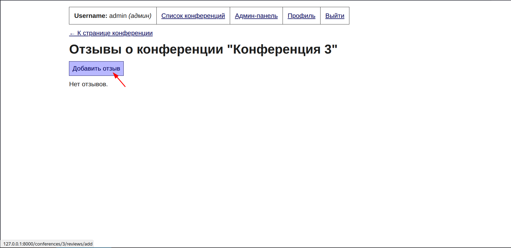

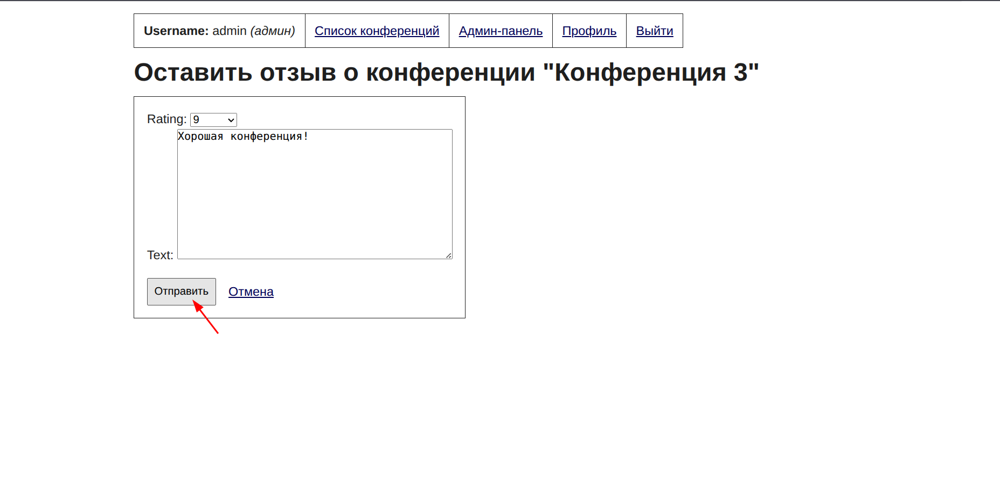

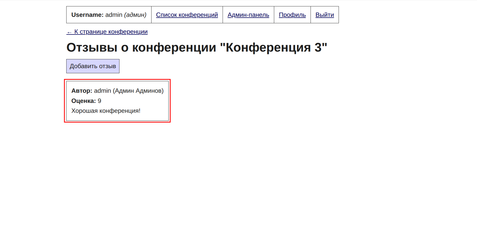

Даты конференции указаны в описании самой конференции, так что в отзыве эту информацию я решил не дублировать. Вся остальная требуемая для комментария информация присутствует: текст комментария, рейтинг (1-10) и информация о комментаторе (username и имя с фамилией).

> Администратор должен иметь возможность указания результатов выступления (рекомендован к публикации или нет) средствами Django-admin.

Для хранения результатов выступления в модель выступления `Presentation` было добавлено отдельное поле `recommendation = models.BooleanField(choices=RECOMMENDATION_CHOICES, null=True, blank=True)`, задать которое можно только через админ-панель. В результате получился следующий процесс выставления результатов:

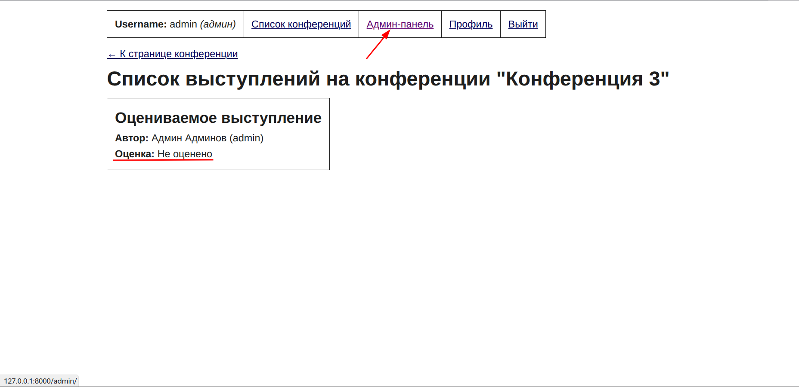

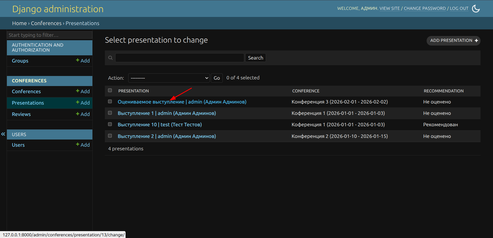

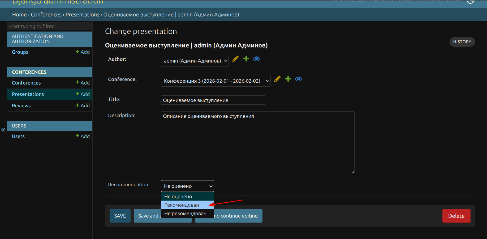

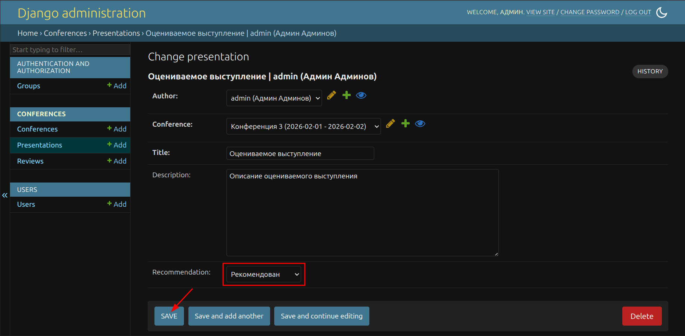

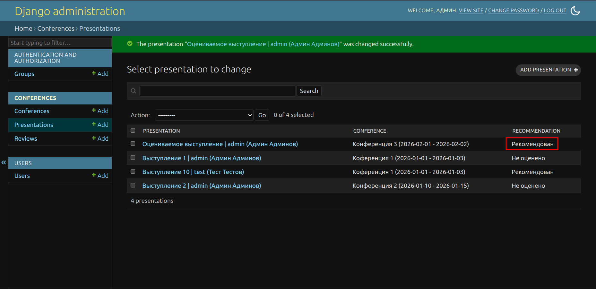

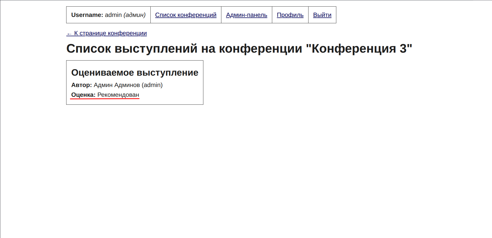

> В клиентской части должна формироваться таблица, отображающая всех участников по конференциям.

Для отображения списка всех выступления было создано следующее представление:

```python title="scientific_conferences_list/conferences/views.py"
class PresentationsListView(LoginRequiredMixin, ListView):
    model = Presentation
    template_name = 'conferences/presentations/presentations_list.html'
    context_object_name = 'presentations'
    paginate_by = 20

    def get_queryset(self):
        conference_id = self.kwargs.get('conference_id')
        return Presentation.objects.filter(conference_id=conference_id)

    def get_context_data(self, **kwargs):
        context = super().get_context_data(**kwargs)
        conference = get_object_or_404(Conference, pk=self.kwargs['conference_id'])
        context['conference'] = conference
        return context
```

Данное представление было зарегистрировано в URLs:

```python title="scientific_conferences_list/conferences/urls.py"
urlpatterns = [
     path('<int:conference_id>/presentations/list',
          PresentationsListView.as_view(),
          name='presentations_list'),
]
```

Также был создан соответствующий HTML-шаблон:

```html title=""

<!DOCTYPE html>
<html>
<head>
    <meta charset="utf-8">
    <title>Список выступлений на конференции "{{ conference.name }}"</title>
    <link rel="stylesheet" type="text/css" href="">
</head>
<body>
    

    <a href="">← К странице конференции</a>

    <h1 class="mt-15">Список выступлений на конференции "{{ conference.name }}"</h1>

    <div class="presentations-list">
    
    <div class="card mt-15 lh16">
        <h2>{{ presentation.title }}</h2>
        <p>
            <strong>Автор:</strong> {{ presentation.author.first_name }} {{ presentation.author.last_name }} 
            ({{ presentation.author.username }})
        </p>
        <p>
            <strong>Оценка:</strong> {{ presentation.get_recommendation_display }}
        </p>
    </div>
    <br>
    
    <p>Нет выступлений.</p>
    
    </div>

    
</body>
</html>
```

В результате получилась следующая страница со списком всех выступлений на конференции:

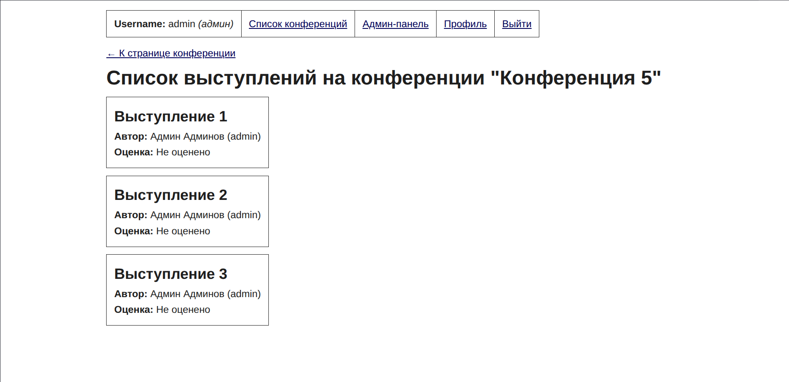

Таким образом, было реализовано веб-приложение на Django, соответствующее всем требованиям задания лабораторной работы.
