# Практическая работа №2.1

## Практическое задание 1

Необходимо установить Django Web framework любым доступным способом.

**Формат именований файлов:**

- Формат имени Django-проекта: “django_project_фамилия”.
- Формат имени Django-приложения: “project_first_app”.

### Выполнение задания 1

В первую очередь создадим venv-окружение для работы с Python и запустим его. Для этого выполним в терминале следующие команды:

```
python3 -m venv .venv
source .venv/bin/activate
```

Теперь установим Django:

```
pip install django
```

Создадим новый django-проект:

```
django-admin startproject django_project_klimenkov
```

А внутри этого проекта создадим новое приложение:

```
python3 manage.py startapp project_first_app
```

В результате нами был успешно установлен Django Web framework и создан базовый проект с приложением внутри. Теперь наш проект имеет следующую структуру файлов:

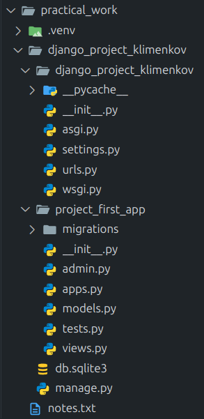

Можно также проверить что проект создан корректно, запустив его на localhost с помощью команды:

```
python3 manage.py runserver
```

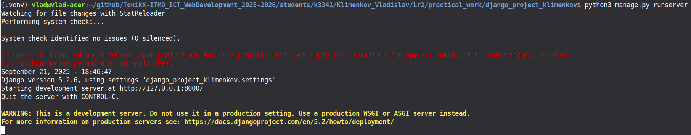

И увидеть, что в браузере по адресу `http://127.0.0.1:8000/` находится приветственная страница Django:

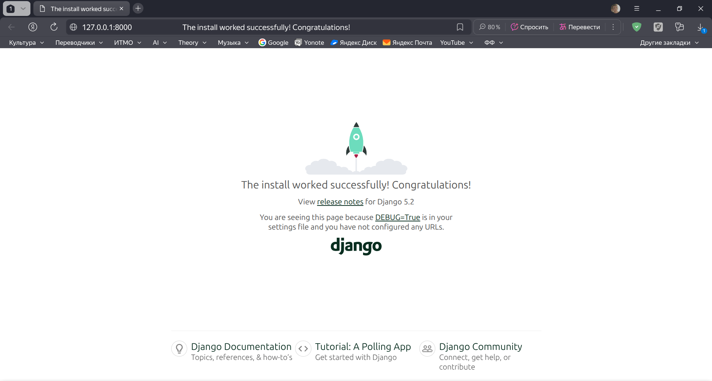

## Практическое задание 2.1

В проекте создать модель данных об автовладельцах в соответствии с рисунком:

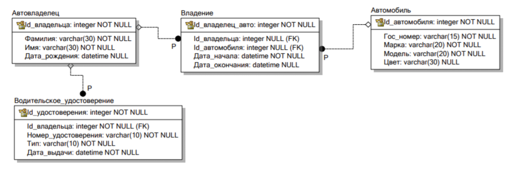

Указание: Таблицы и атрибуты именовать только на латинице.

Важно! Не забывайте о внешних ключах, полях выбора, правильном оформлении ассоциативной сущности в модели.

### Выполнение задания 2.1

В Django модели хранятся в файле `models.py`. Создадим в этом файле необходимые модели в соответствии с рисунком:

```python title="django_project_klimenkov/project_first_app/models.py"
from django.db import models
from django.contrib.auth.models import AbstractUser


class Owner(AbstractUser):
    birth_date = models.DateField(null=True, blank=True)

    def __str__(self):
        return f"{self.last_name} {self.first_name}"


class Car(models.Model):
    car_id = models.AutoField(primary_key=True)
    license_plate = models.CharField(max_length=15)
    model = models.CharField(max_length=20)
    color = models.CharField(max_length=30, null=True, blank=True)

    def __str__(self):
        return f"{self.model} ({self.license_plate})"


class DrivingLicense(models.Model):
    LICENSE_TYPES = [
        ('A', 'Категория A'),
        ('B', 'Категория B'),
        ('C', 'Категория C'),
        ('D', 'Категория D'),
        ('BE', 'Категория BE'),
        ('CE', 'Категория CE'),
        ('DE', 'Категория DE'),
        ('Tm', 'Категория Tm'),
        ('Tb', 'Категория Tb'),
        ('M', 'Категория M'),
        ('A1', 'Подкатегория A1'),
        ('B1', 'Подкатегория B1'),
        ('C1', 'Подкатегория C1'),
        ('D1', 'Подкатегория D1'),
        ('C1E', 'Подкатегория C1E'),
        ('D1E', 'Подкатегория D1E'),
    ]

    license_id = models.AutoField(primary_key=True)
    owner = models.ForeignKey(Owner, on_delete=models.CASCADE)
    license_number = models.CharField(max_length=10)
    license_type = models.CharField(max_length=10, choices=LICENSE_TYPES)
    issue_date = models.DateField()

    def __str__(self):
        return f"{self.license_number} ({self.license_type})"


class Ownership(models.Model):
    ownership_id = models.AutoField(primary_key=True)
    owner = models.ForeignKey(Owner, on_delete=models.CASCADE)
    car = models.ForeignKey(Car, on_delete=models.CASCADE)
    start_date = models.DateField()
    end_date = models.DateField(null=True, blank=True)

    def __str__(self):
        return f"{self.owner} - {self.car} ({self.start_date} - {self.end_date})"
```

Для создания модели автовладельца воспользуемся `AbstractUser`, который уже содержит в себе поля `first_name`, `last_name` и `id`, а значит можно в классе модели их не указывать.

Для создания всех остальных моделей воспользуемся более общей `Model`, для которой ID указывать нужно.

Типы данных задаём с помощью `django.db.models` (`AutoField` - для ID, `DateField` - для дат, `CharField` - для строковых значений, `ForeignKey` - для внешних ключей).

Связь "многие ко многим" между автовладельцами и автомобилями реализуем с помощью отдельной модели `Ownership`.

Делаем поле `license_type` для `DrivingLicense` выборным с помощью параметра `choices=LICENSE_TYPES`, где `LICENSE_TYPES` - список с допустимыми значениями.

Для полей, которые могут быть необязательными, указываем параметры `null=True, blank=True`.

## Практическое задание 2.2

Создать миграции и применить их к базе данных.

### Выполнение задания 2.2

Для того чтобы сделать миграцию, нам нужно сначала зарегистрировать приложение `project_first_app`. Для этого перейдём в файл общих настроек проекта `django_project_klimenkov/django_project_klimenkov/settings.py` и добавим название нашего приложения в `INSTALLED_APPS`:

```python title="django_project_klimenkov/django_project_klimenkov/settings.py"
INSTALLED_APPS = [
    'django.contrib.admin',
    'django.contrib.auth',
    'django.contrib.contenttypes',
    'django.contrib.sessions',
    'django.contrib.messages',
    'django.contrib.staticfiles',
    'project_first_app', # Регистрируем наше приложение
]
```

Также, так как мы использовали `AbstractUser` для создания модели `Owner`, то нам нужно указать в настройках, что теперь `Owner` будет использоваться вместо базовой модели пользователя:

```python title="django_project_klimenkov/django_project_klimenkov/settings.py"
# Добавим эту строку
AUTH_USER_MODEL = 'project_first_app.Owner'
```

Теперь создадим миграцию с помощью команды:

```
python3 manage.py makemigrations project_first_app
```

Видим, что в папке `django_project_klimenkov/project_first_app/migrations` появился файл `0001_initial.py`, который содержит информацию о созданной нами миграции:

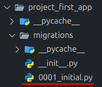

Применим миграцию к базе данных с помощью команды:

```
python3 manage.py migrate
```

Теперь если посмотреть структуру файла `db.sqlite3`, в котором хранится база данных всего проекта, то можно увидеть следующие таблицы:

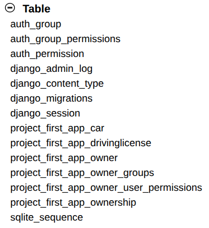

Как можно заметить, база данных содержит как таблицы для созданных нами моделей, так и служебные таблицы. Тем не менее, наличие всех этих таблиц говорит о том, что миграция прошла успешно.

## Практическое задание 3

Необходимо заполнить таблицы данными средствами админ-панели:

- Зарегистрировать автовладельца и остальные модели данных в админ-панели.
- Создать суперпользователя.
- Через админ-панель добавить двух владельцев автомобилей, четыре автомобиля. Далее связать каждого владельца минимум с тремя автомобилями, так, чтобы не было пересечений по датам владения и продажи.

### Выполнение задания 3

Для начала зарегистрируем все созданные модели данных, чтобы к ним можно было бы получить доступ из админ-панели. Для этого перейдём в файл `django_project_klimenkov/project_first_app/admin.py` и укажем там все регистрируемые модели, а также те их поля, которые будут отображаться в общем списке:

```python title="django_project_klimenkov/project_first_app/admin.py"
from django.contrib import admin
from .models import Owner, Car, DrivingLicense, Ownership


@admin.register(Owner)
class OwnerAdmin(admin.ModelAdmin):
    list_display = ['id', 'first_name', 'last_name', 'birth_date']


@admin.register(Car)
class CarAdmin(admin.ModelAdmin):
    list_display = ['car_id', 'license_plate', 'model', 'color']


@admin.register(DrivingLicense)
class DrivingLicenseAdmin(admin.ModelAdmin):
    list_display = ['license_id', 'owner', 'license_number', 'license_type', 'issue_date']


@admin.register(Ownership)
class OwnershipAdmin(admin.ModelAdmin):
    list_display = ['ownership_id', 'owner', 'car', 'start_date', 'end_date']
```

Также для получения доступа к админ-панели требуется создать суперпользователя, указав для него имя пользователя и пароль. Сделаем это можно с помощью следующей команды:

```
python3 manage.py createsuperuser
```

После создания суперпользователя запустим сервер и перейдём по адресу `http://127.0.0.1:8000/admin/`, где в появившемся окне нужно будет ввести username и пароль суперпользователя, после чего мы сможем получить доступ к админ-панели:

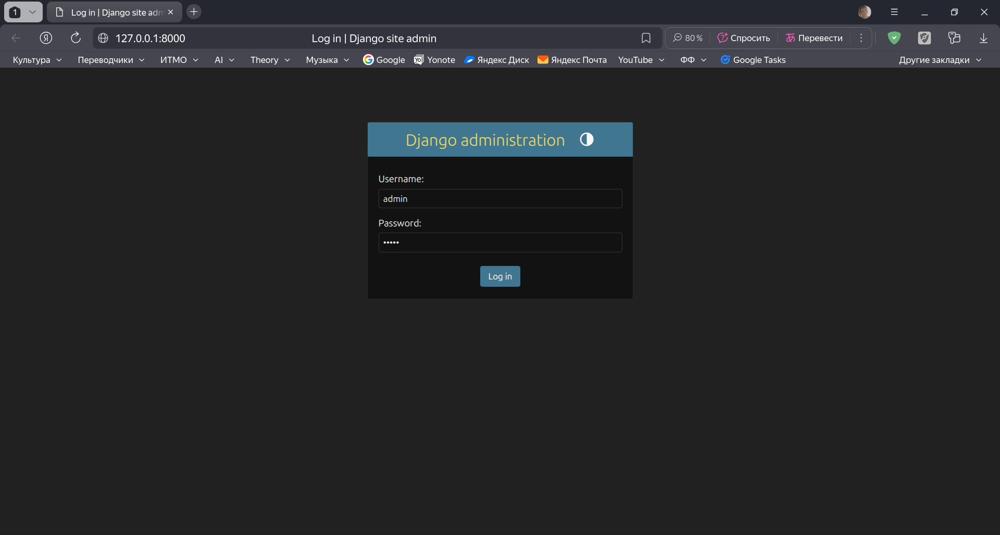

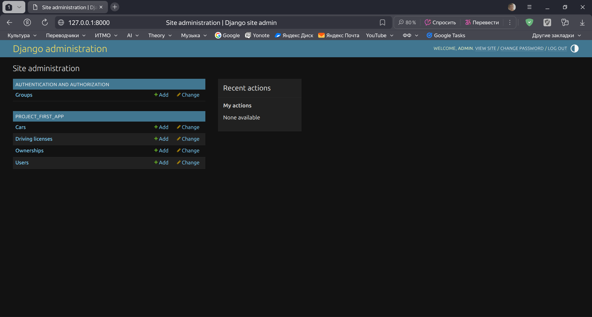

Теперь через админ-панель добавим необходимые данные.

В случае с `Owner` мы использовали `AbstractUser`, а значит полей доступных для ввода в админ-панели будет больше, чем мы напрямую указывали, но чтобы успешно добавить автовладельца будет достаточно задать значения лишь нужным нам полям `first_name`, `last_name` и `birth_date`, а также полям `username` и `password`, которые являются обязательными для `AbstractUser` (так как мы не будем использовать эти поля, то им можно задать произвольные значения, но так, чтобы `username` у всех пользователей был уникальным):

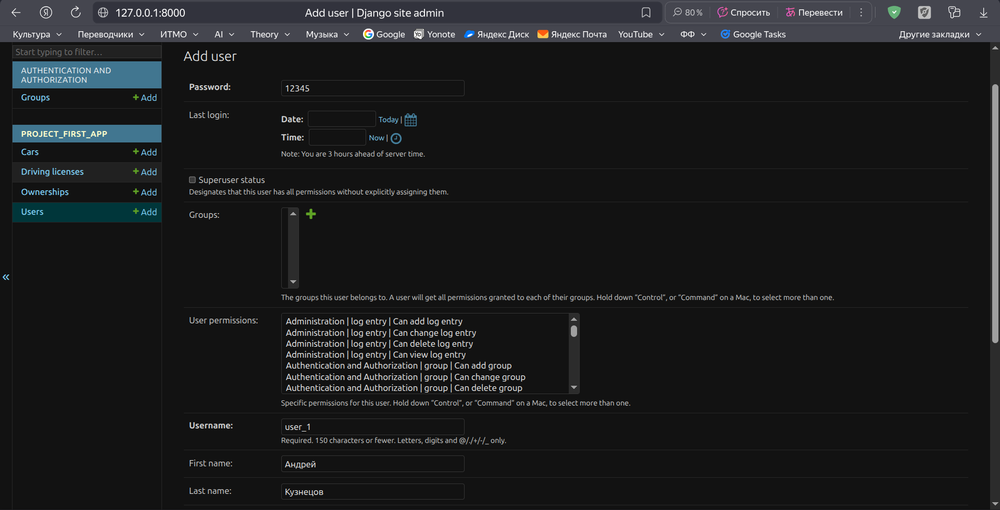

Создадим таким образом двух автовладельцев:

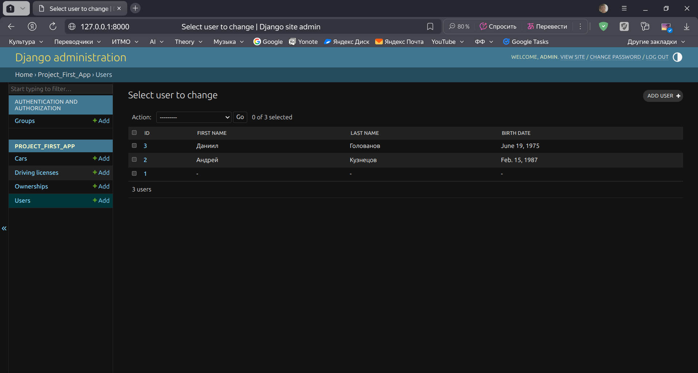

(Пользователь с ID 1 является суперпользователем, которого мы создали ранее.)

Аналогичным образом добавим четыре автомобиля и свяжем каждого владельца минимум с тремя автомобилями, избегая пересечения по датам:

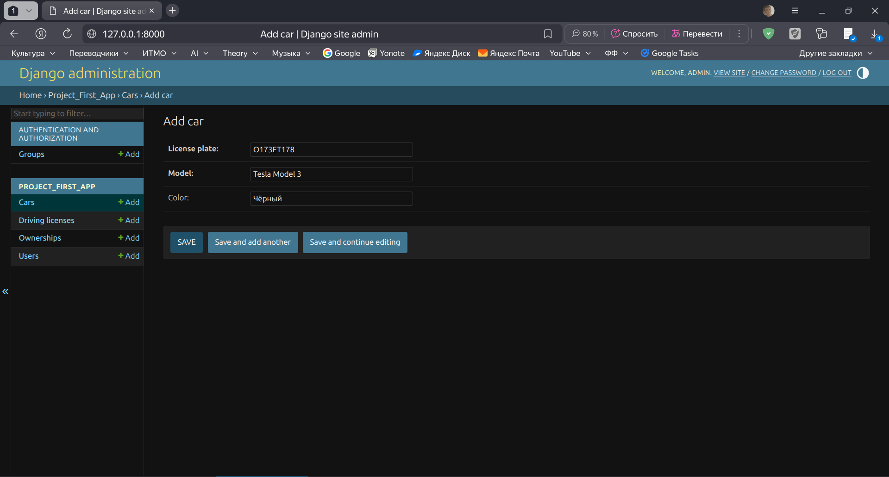

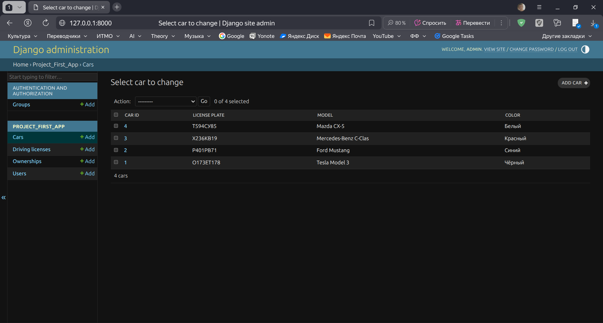

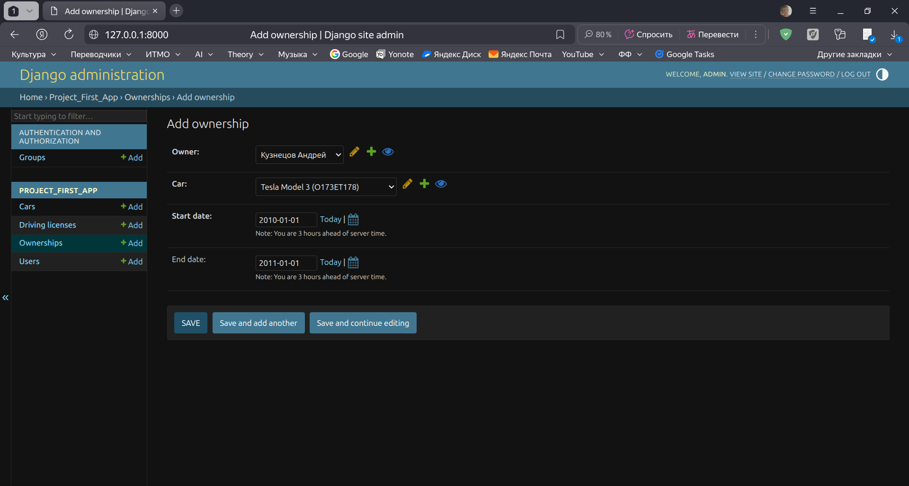

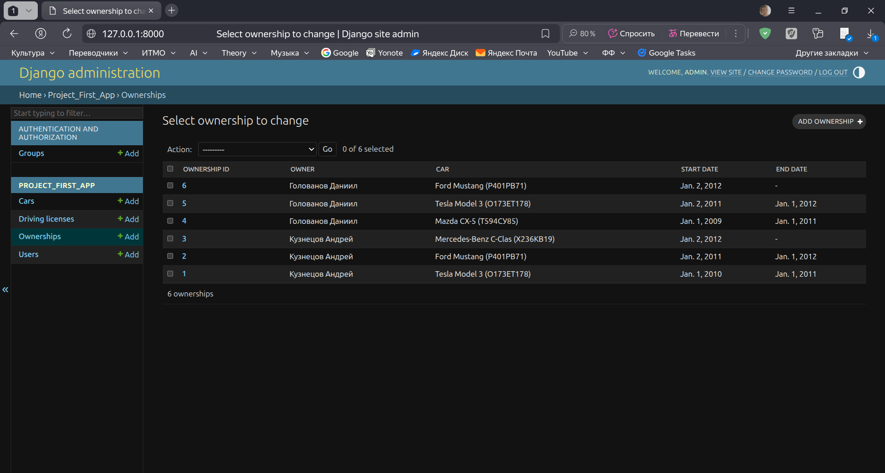
