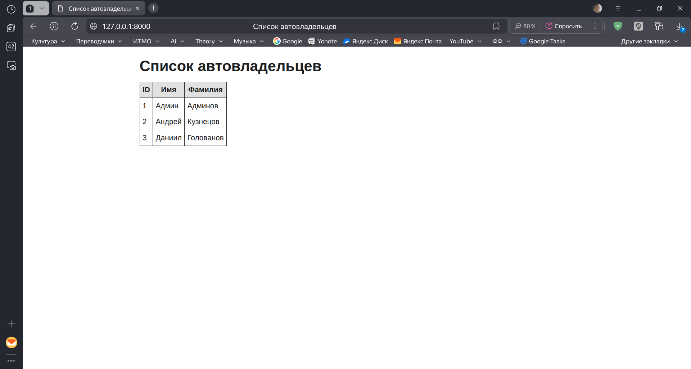
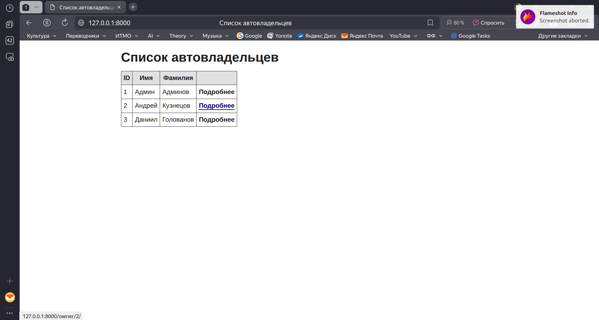
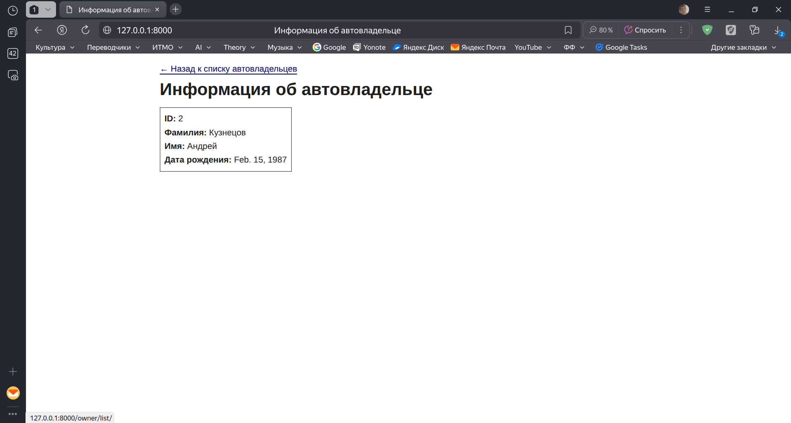
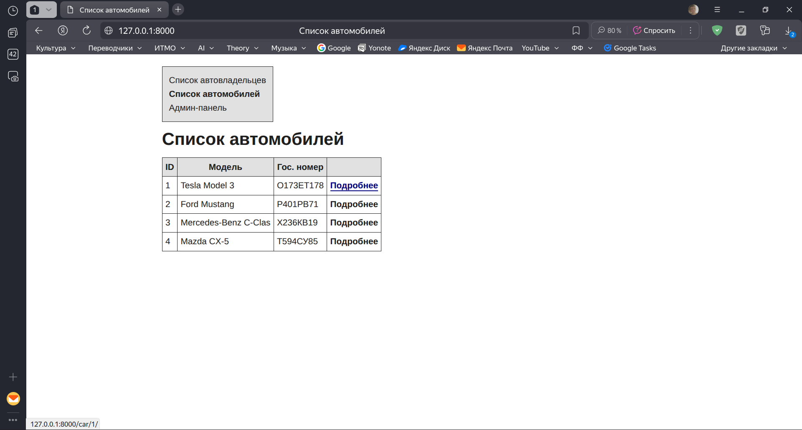
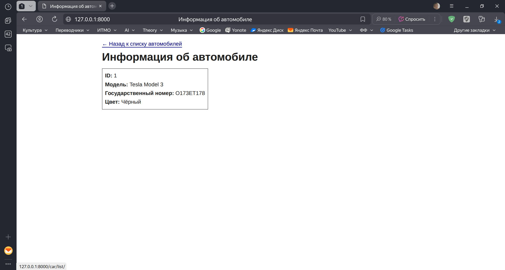

# Практическая работа №2.2

## Практическое задание 1

Правильно настроить связь между автомобилем, владением и владельцем.

### Выполнение задания 1

Чтобы реализовать связь "многие-ко-многим" между владельцем и автомобилем через владение, воспользуемся полем `ManyToManyField`:

```python title="django_project_klimenkov/project_first_app/models.py"
class Owner(AbstractUser):
    birth_date = models.DateField(null=True, blank=True)

    # Добавим это поле для реализации связи "многие-ко-многим"
    cars = models.ManyToManyField('Car', through='Ownership')

    def __str__(self):
        return f"{self.last_name} {self.first_name}"
```

Теперь связь между владельцем и автомобилем стала более полной, что даёт возможность в перспективе обращаться к автомобилям через их владельца и к владельцам через автомобиль, которым они обладали или обладают.

Чтобы применить эти изменения нужно будет сделать миграцию:

```
python3 manage.py makemigrations project_first_app
python3 manage.py migrate
```

## Практическое задание 2

1. Реализовать вывод всех владельцев функционально. Добавить данные минимум от трех владельцах. Должны быть реализованы контроллер (views) и шаблоны (templates).
2. Реализовать вывод всех автомобилей, вывод автомобиля по id, обновления на основе классов. Добавить данные минимум о трех автомобилях. Должны быть реализованы контроллер (views) и шаблоны (templates).

### Выполнение задания 2

Для начала реализуем вывод всех владельцев в виде списка с помощью представления на основе функции.

Создадим представление для вывода списка всех владельцев:

```python title="django_project_klimenkov/project_first_app/views.py"
def owners_list(request):
    """
    Представление для отображения списка всех владельцев автомобилей.
    """
    # Получаем всех владельцев и передаём их в html-шаблон
    owners = Owner.objects.all()
    return render(request, 'owners/owners_list.html', {'owners': owners})
```

Также создадим соответствующий html-шаблон:

```html title="django_project_klimenkov/templates/owners/owners_list.html"

<!DOCTYPE html>
<html lang="ru">
<head>
    <meta charset="UTF-8">
    <meta name="viewport" content="width=device-width, initial-scale=1.0">
    <title>Список автовладельцев</title>
    <link rel="stylesheet" href="" type="text/css">
</head>
<body>

    <h1>Список автовладельцев</h1>
    
    
        <table class="table">
            <thead>
                <tr>
                    <th>ID</th>
                    <th>Имя</th>
                    <th>Фамилия</th>
                </tr>
            </thead>
            <tbody>
                
                <tr>
                    <td>{{ owner.id }}</td>
                    <td>{{ owner.first_name }}</td>
                    <td>{{ owner.last_name }}</td>
                </tr>
                
            </tbody>
        </table>
    
        <p>Автовладельцы не найдены.</p>
    
</body>
</html>
```

В шаблоне перебираем всех владельцев и выводим основную информацию о них. Также подключаем CSS-стили, чтобы список выглядел более красиво.

Чтобы к странице можно было получить доступ по url-запросу, зарегистрируем созданное выше представление в `urls.py`:

```python title="django_project_klimenkov/project_first_app/urls.py"
urlpatterns = [
    path('owner/<int:id>/', views.owner_detail, name='owner_detail'),

    # Даём доступ к представлению по url-запросу
    path('owner/list/', views.owners_list, name='owners_list'),
]
```

Теперь при переходе по адресу `http://127.0.0.1:8000/owner/list/` видим таблицу со всеми владельцами:



Чтобы упростить навигацию по веб-приложению, сделаем переадресацию с адреса `http://127.0.0.1:8000/` на `http://127.0.0.1:8000/owner/list/`, чтобы по умолчанию открывался именно список владельцев:

```python title="django_project_klimenkov/project_first_app/views.py"
# Добавим представление для переадресация в owners_list
def root_redirect(request):
    return redirect('owners_list')
```

```python title="django_project_klimenkov/project_first_app/urls.py"
urlpatterns = [
    # Привяжем root_redirect к корневому адресу
    path('', views.root_redirect),

    path('owner/<int:id>/', views.owner_detail, name='owner_detail'),
    path('owner/list/', views.owners_list, name='owners_list'),
]
```

Также дадим пользователю возможность перейти со страницы списка владельцев к странице с детальной информацией о владельце и обратно.

```html title="django_project_klimenkov/templates/owners/owners_list.html"

    <table class="table">
        <thead>
            <tr>
                <th>ID</th>
                <th>Имя</th>
                <th>Фамилия</th>
                <th></th>
            </tr>
        </thead>
        <tbody>
            
            <tr>
                <td>{{ owner.id }}</td>
                <td>{{ owner.first_name }}</td>
                <td>{{ owner.last_name }}</td>
                <td>

                    <!-- Добавляем ссылку на страницу с информацией о владельце -->
                    <a href="">
                        Подробнее
                    </a>

                </td>
            </tr>
            
        </tbody>
    </table>

    <p>Автовладельцы не найдены.</p>

```

```html title=""
<body>

    <!-- Добавляем ссылку на список владельцев -->
    <a href="" class="back-button">← Назад к списку автовладельцев</a>

    <h1>Информация об автовладельце</h1>
    <div class="detail-card">
        <p><strong>ID:</strong> {{ owner.id }}</p>
        <p><strong>Фамилия:</strong> {{ owner.last_name }}</p>
        <p><strong>Имя:</strong> {{ owner.first_name }}</p>
        <p><strong>Дата рождения:</strong> {{ owner.birth_date }}</p>
    </div>
</body>
```

Теперь между этими страницами можно переключаться:





Реализуем аналогичный функционал и для автомобилей, но в этот раз с помощью представлений на основе классов.

```python title="django_project_klimenkov/project_first_app/views.py"
from django.views.generic import ListView, DetailView
from .models import Owner, Car


# Представление для вывода списка автомобилей
class CarsListView(ListView):
    model = Car
    template_name = 'cars/cars_list.html'
    context_object_name = 'cars'


# Представление для вывода детальной информации об автомобиле
class CarDetailView(DetailView):
    model = Car
    template_name = 'cars/car_detail.html'
    context_object_name = 'car'
    pk_url_kwarg = 'car_id'
```

Создаём соответствующие html-шаблоны:

```html title="django_project_klimenkov/templates/cars/car_detail.html"

<!DOCTYPE html>
<html lang="ru">
<head>
    <meta charset="UTF-8">
    <meta name="viewport" content="width=device-width, initial-scale=1.0">
    <title>Информация об автомобиле</title>
    <link rel="stylesheet" href="" type="text/css">
</head>
<body>
    <a href="" class="back-button">← Назад к списку автомобилей</a>

    <h1>Информация об автомобиле</h1>
    
    <div class="detail-card">
        <p><strong>ID:</strong> {{ car.car_id }}</p>
        <p><strong>Модель:</strong> {{ car.model }}</p>
        <p><strong>Государственный номер:</strong> {{ car.license_plate }}</p>
        <p><strong>Цвет:</strong> {{ car.color|default:"Не указан" }}</p>
    </div>
</body>
</html>
```

```html title="django_project_klimenkov/templates/cars/cars_list.html"

<!DOCTYPE html>
<html lang="ru">
<head>
    <meta charset="UTF-8">
    <meta name="viewport" content="width=device-width, initial-scale=1.0">
    <title>Список автомобилей</title>
    <link rel="stylesheet" href="" type="text/css">
</head>
<body>
    <h1>Список автомобилей</h1>
    
    
        <table class="table">
            <thead>
                <tr>
                    <th>ID</th>
                    <th>Модель</th>
                    <th>Гос. номер</th>
                    <th></th>
                </tr>
            </thead>
            <tbody>
                
                <tr>
                    <td>{{ car.car_id }}</td>
                    <td>{{ car.model }}</td>
                    <td>{{ car.license_plate }}</td>
                    <td>
                        <a href="">
                            Подробнее
                        </a>
                    </td>
                </tr>
                
            </tbody>
        </table>
    
        <p>Автомобили не найдены.</p>
    
</body>
</html>
```

Регистрируем url-адреса:

```python title="django_project_klimenkov/project_first_app/urls.py"
urlpatterns = [
    path('', views.root_redirect),

    # Владельцы
    path('owner/list/', views.owners_list, name='owners_list'),
    path('owner/<int:id>/', views.owner_detail, name='owner_detail'),

    # Автомобили
    path('car/list/', views.CarsListView.as_view(), name='cars_list'),
    path('car/<int:car_id>/', views.CarDetailView.as_view(), name='car_detail'),
]
```

Также добавим в `owners_list.html` и `cars_list.html` меню для переключения между списками и доступом к админ-панели:

```html title="django_project_klimenkov/templates/owners/owners_list.html"
<body>

    <!-- Добавленное меню -->
    <div class="nav-menu">
        <p><strong>Список автовладельцев</strong></p>
        <a href="">Список автомобилей</a><br>
        <a href="/admin">Админ-панель</a>
    </div>

    <h1>Список автовладельцев</h1>
```

```html title="django_project_klimenkov/templates/cars/cars_list.html"
<body>
    <div class="nav-menu">
        <a href="">Список автовладельцев</a>
        <p><strong>Список автомобилей</strong></p>
        <a href="/admin">Админ-панель</a>
    </div>

    <h1>Список автомобилей</h1>
```

В результате получился следующий функционал для автомобилей (аналогичный таковому для владельцев, но на основе классов):




