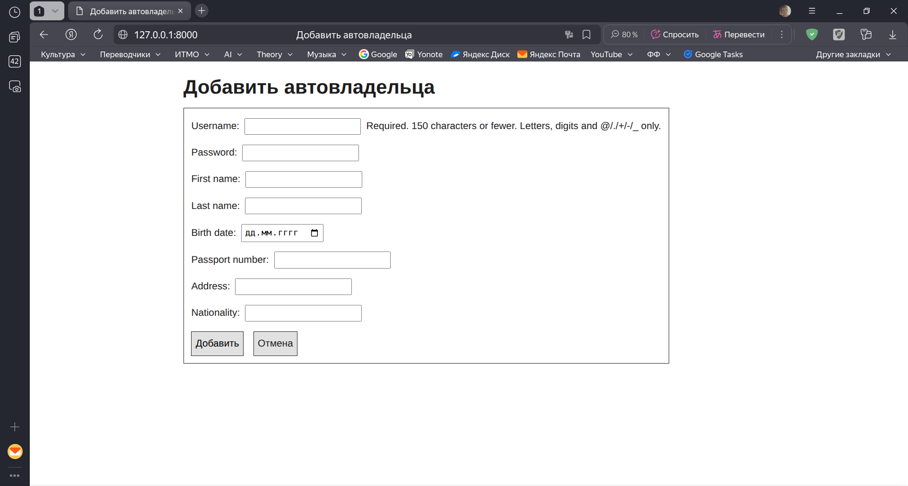
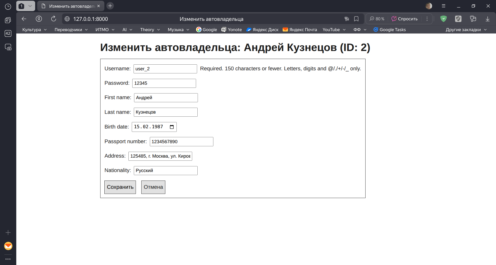
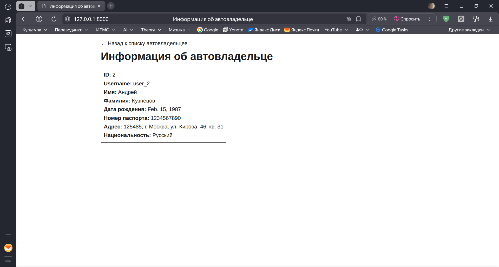
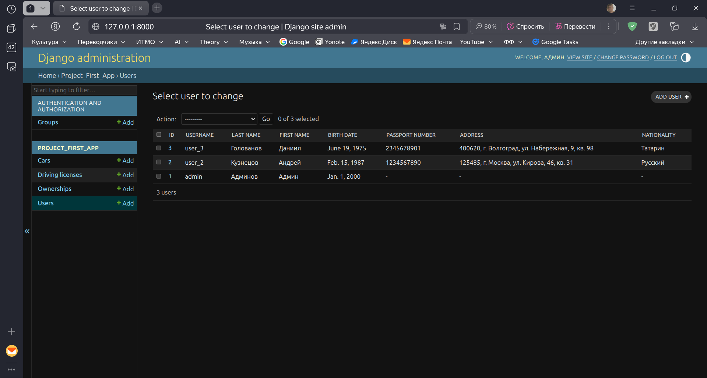

# Практическая работа №2.3

## Практическое задание 1

Сделать “Владельца автомобиля” пользователем и расширить модель пользователя его атрибутами, так, чтобы о нем хранилась следующая информация:

- номер паспорта;
- домашний адрес;
- национальность.

Отобразить новые поля пользователя в Django Admin. Отредактировать код из предыдущих работ, так, чтобы выводилась информация о пользователях.

Реализовать интерфейс создания пользователя с новыми атрибутами.

### Выполнение задания 1

Так как мы изначально создали модель владельца с использованием `AbstractUser`, то значит владелец уже является пользователем.

Расширим модель пользователя новыми атрибутами:

```python title="django_project_klimenkov/project_first_app/models.py"
class Owner(AbstractUser):
    birth_date = models.DateField(null=True, blank=True)

    # Добавим требуемые поля
    passport_number = models.CharField(max_length=10, null=True, blank=True)
    address = models.CharField(max_length=255, null=True, blank=True)
    nationality = models.CharField(max_length=100, null=True, blank=True)

    cars = models.ManyToManyField('Car', through='Ownership')

    def __str__(self):
        return f"{self.last_name} {self.first_name}"
```

Сделаем миграцию, чтобы применить изменения к базе данных:

```
python3 manage.py makemigrations project_first_app
python3 manage.py migrate
```

Добавим новые поля в html-шаблон `owner_detail.html`:

```html title="django_project_klimenkov/templates/owners/owner_detail.html"
<div class="detail-card">
    <p><strong>ID:</strong> {{ owner.id }}</p>
    <p><strong>Username:</strong> {{ owner.username }}</p>
    <p><strong>Имя:</strong> {{ owner.first_name }}</p>
    <p><strong>Фамилия:</strong> {{ owner.last_name }}</p>
    <p><strong>Дата рождения:</strong> {{ owner.birth_date }}</p>

    <!-- Добавляем новые поля -->
    <p><strong>Номер паспорта:</strong> {{ owner.passport_number }}</p>
    <p><strong>Адрес:</strong> {{ owner.address }}</p>
    <p><strong>Национальность:</strong> {{ owner.nationality }}</p>
</div>
```

Также добавим эти поля в `OwnerForm`:

```python title="django_project_klimenkov/project_first_app/forms.py"
class OwnerForm(forms.ModelForm):
    class Meta:
        model = Owner

        # Добавляем новые поля
        fields = ['username', 'password', 'first_name', 'last_name', 'birth_date', 'passport_number', 'address', 'nationality']

        widgets = {
            'birth_date': forms.DateInput(attrs={'type': 'date'})
        }
```

Теперь эти дополнительные поля будут отображаться как на странице с детальной информацией о владельце, так и в формах создания и изменения владельца:







Также добавим отображение этих полей в админ-панель:

```python title="django_project_klimenkov/project_first_app/admin.py"
@admin.register(Owner)
class OwnerAdmin(admin.ModelAdmin):

    # Добавляем отображение новых полей
    list_display = ['id', 'username', 'last_name', 'first_name', 'birth_date', 'passport_number', 'address', 'nationality']
```



На этом задание можно считать выполненным.
