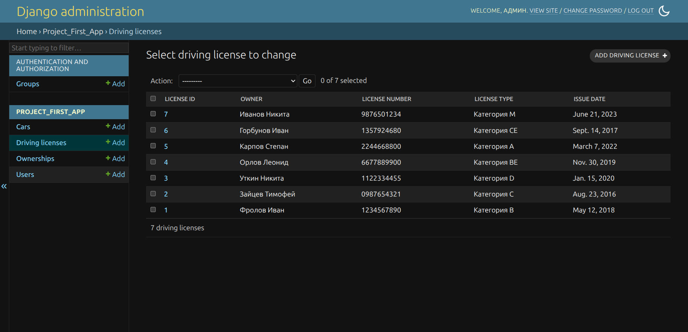

# Практическая работа №3.1

## Практическое задание 1

### Описание задания

Воспользуйтесь проектом из практики 2.1:


Напишите запрос на создание 6-7 новых автовладельцев и 5-6 автомобилей, каждому автовладельцу назначьте удостоверение и от 1 до 3 автомобилей. Задание можете выполнить либо в интерактивном режиме интерпретатора, либо в отдельном python-файле. Результатом должны стать запросы и отображение созданных объектов.

> Если вы добавляете автомобили владельцу через метод .add(), не забудьте заполнить также ассоциативную сущность “владение”

### Выполнение задания

Для создания требуемых объектов будем использовать следующий код:

```python
import random
from datetime import date, timedelta
from project_first_app.models import Owner, Car, DrivingLicense, Ownership

owners_data = [
    {
        'username': 'frolov',
        'password': '12345',
        'first_name': 'Иван',
        'last_name': 'Фролов',
        'birth_date': date(1990, 5, 15),
        'passport_number': '2847591036',
        'address': 'г. Самара, ул. Матросова, 10, кв. 2',
        'nationality': 'Русский'
    },
    {
        'username': 'zaitsev',
        'password': '12345',
        'first_name': 'Тимофей',
        'last_name': 'Зайцев',
        'birth_date': date(1985, 8, 22),
        'passport_number': '7392048165',
        'address': 'г. Казань, ул. Трактовая, 50, кв. 1',
        'nationality': 'Русский'
    },
    {
        'username': 'utkin',
        'password': '12345',
        'first_name': 'Никита',
        'last_name': 'Уткин',
        'birth_date': date(1992, 3, 10),
        'passport_number': '1503847291',
        'address': 'г. Москва, ул. Овражная, 43, кв. 1',
        'nationality': 'Татарин'
    },
    {
        'username': 'orlov',
        'password': '12345',
        'first_name': 'Леонид',
        'last_name': 'Орлов',
        'birth_date': date(1988, 11, 5),
        'passport_number': '9462173580',
        'address': 'г. Казань, ул. Октябрьская, 43, кв. 24',
        'nationality': 'Русский'
    },
    {
        'username': 'karpov',
        'password': '12345',
        'first_name': 'Степан',
        'last_name': 'Карпов',
        'birth_date': date(1995, 7, 30),
        'passport_number': '3728461059',
        'address': 'г. Тольятти, ул. Родниковая, 7, кв. 97',
        'nationality': 'Чуваш'
    },
    {
        'username': 'gorbunov',
        'password': '12345',
        'first_name': 'Иван',
        'last_name': 'Горбунов',
        'birth_date': date(1991, 12, 18),
        'passport_number': '6059138427',
        'address': 'г. Воронеж, ул. Клубная, 45, кв. 40',
        'nationality': 'Русский'
    },
    {
        'username': 'ivanov',
        'password': '12345',
        'first_name': 'Никита',
        'last_name': 'Иванов',
        'birth_date': date(1989, 2, 15),
        'passport_number': '8812345678',
        'address': 'г. Нижний Новгород, ул. Железнодорожная, 17, кв. 39',
        'nationality': 'Армянин'
    }
]

cars_data = [
    {
        'license_plate': 'А777ВС78',
        'model': 'Lada Vesta SW Cross',
        'color': 'Красный'
    },
    {
        'license_plate': 'М001АА99',
        'model': 'Haval Dargo',
        'color': 'Синий'
    },
    {
        'license_plate': 'К999ОР178',
        'model': 'BMW M240i xDrive',
        'color': 'Жёлтый'
    },
    {
        'license_plate': 'Т255НУ50',
        'model': 'Kia Stinger',
        'color': 'Красный'
    },
    {
        'license_plate': 'Е123АВ77',
        'model': 'Mazda CX-50',
        'color': 'Зелёный'
    },
    {
        'license_plate': 'В444ММ161',
        'model': 'Jeep Avenger',
        'color': 'Белый'
    },
]

driving_licenses_data = [
    {
        "license_number": "1234567890",
        "license_type": "B",
        "issue_date": date(2018, 5, 12),
    },
    {
        "license_number": "0987654321",
        "license_type": "C",
        "issue_date": date(2016, 8, 23),
    },
    {
        "license_number": "1122334455",
        "license_type": "D",
        "issue_date": date(2020, 1, 15),
    },
    {
        "license_number": "6677889900",
        "license_type": "BE",
        "issue_date": date(2019, 11, 30),
    },
    {
        "license_number": "2244668800",
        "license_type": "A",
        "issue_date": date(2022, 3, 7),
    },
    {
        "license_number": "1357924680",
        "license_type": "CE",
        "issue_date": date(2017, 9, 14),
    },
    {
        "license_number": "9876501234",
        "license_type": "M",
        "issue_date": date(2023, 6, 21),
    }
]

owners = []
for owner_data in owners_data:
    owner = Owner.objects.create_user(
        username=owner_data['username'],
        password=owner_data['password'],
        first_name=owner_data['first_name'],
        last_name=owner_data['last_name'],
        birth_date=owner_data['birth_date'],
        passport_number=owner_data['passport_number'],
        address=owner_data['address'],
        nationality=owner_data['nationality']
    )
    owners.append(owner)

cars = []
for car_data in cars_data:
    car = Car.objects.create(
        license_plate=car_data['license_plate'],
        model=car_data['model'],
        color=car_data['color']
    )
    cars.append(car)

for i, license_data in enumerate(driving_licenses_data):
    DrivingLicense.objects.create(
        owner=owners[i],
        license_number=license_data['license_number'],
        license_type=license_data['license_type'],
        issue_date=license_data['issue_date']
    )

# (<индекс_владельца> [<индексы_автомобилей>])
ownerships_plan = [
    (0, [0, 1]),
    (1, [2, 3, 4]),
    (2, [5]),
    (3, [0, 2]),
    (4, [1, 3, 4]),
    (5, [2, 5]),
    (6, [0])
]

for owner_idx, car_indices in ownerships_plan:
    owner = owners[owner_idx]
    for car_idx in car_indices:
        start_date = date.today() - timedelta(days=random.randint(1, 3650))
        days_after_start = random.randint(1, 1825)
        end_date = start_date + timedelta(days=days_after_start)
        Ownership.objects.create(
            owner=owner,
            car=cars[car_idx],
            start_date=start_date,
            end_date=end_date
        )
```

Запустим интерактивный режим:

```
python3 manage.py shell
```

Вставим написанный выше код в терминал:


Проверим в админ-панели, что требуемые объекты создались:





Видим, что все требуемые объекты были успешно добавлены в базу данных.
