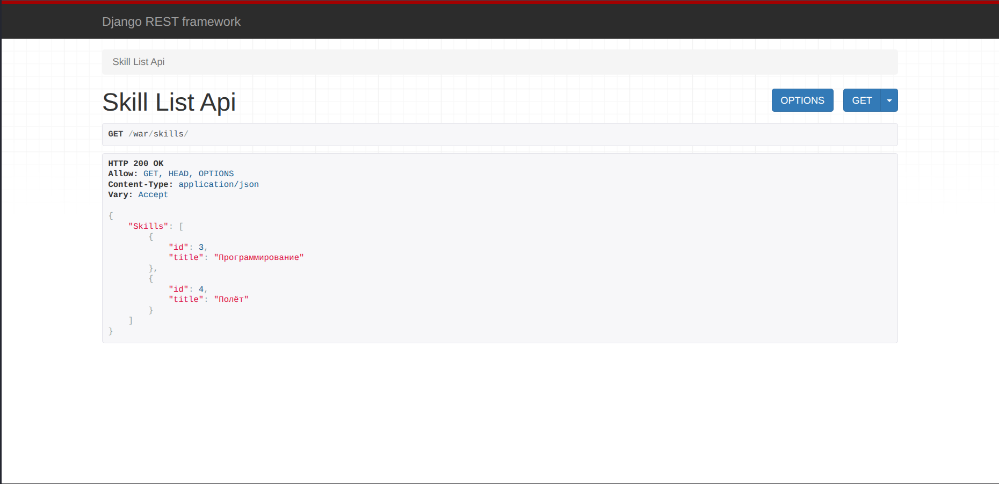
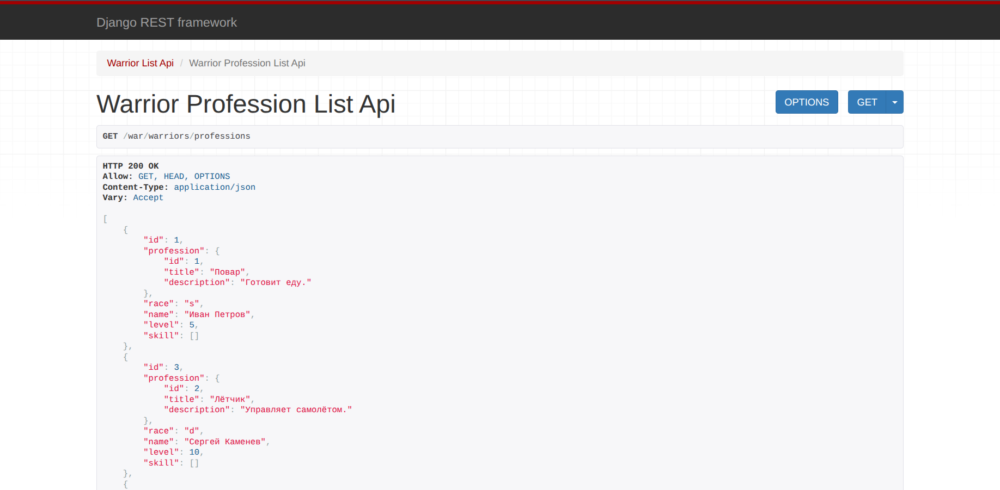
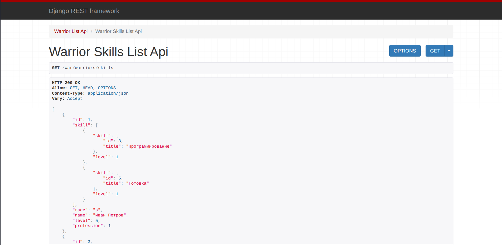
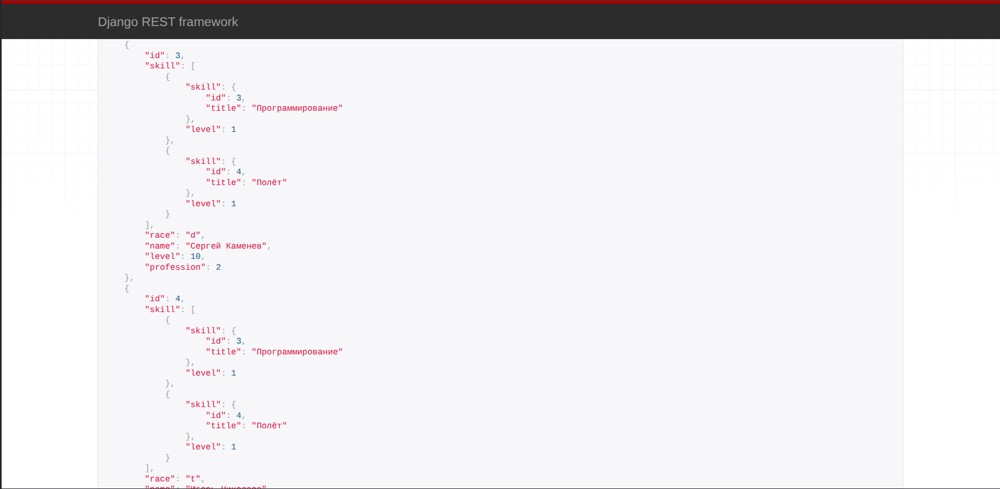
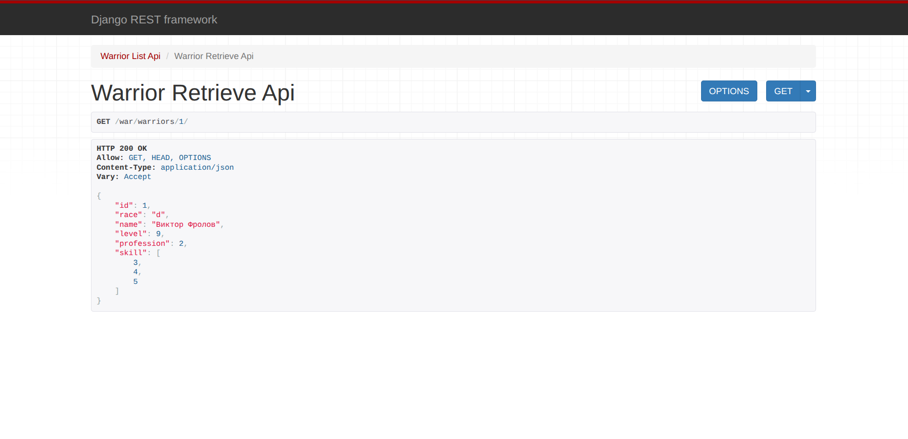

# Практическая работа №3.2

## Практическое задание 1

### Описание задания

Реализовать ендпоинты для добавления и просмотра скиллов методом, описанным в пункте выше.

### Выполнение задания

Для начала создадим serializer для преобразования объектов скиллов между Django-форматом и JSON-форматом:

```python title="warriors_project/warriors_app/serializers.py"
class ProfessionSerializer(serializers.ModelSerializer):
    class Meta:
        model = Profession
        fields = "__all__"
```

Теперь используя созданный serializer создадим два представления для просмотра и добавления скиллов:

```python title="warriors_project/warriors_app/views.py"
# Просмотр скиллов
class SkillListAPIView(APIView):
    def get(self, request):
        skills = Skill.objects.all()
        serializer = SkillSerializer(skills, many=True)
        return Response({"Skills": serializer.data})


# Создание скилла
class SkillCreateAPIView(APIView):
    def post(self, request):
       skill = request.data
       serializer = SkillSerializer(data=skill)
       if serializer.is_valid(raise_exception=True):
           skill_saved = serializer.save()
       return Response({"Success": "Skill '{}' created successfully.".format(skill_saved.title)})
```

Добавим данные представления в URLs:

```python title="warriors_project/warriors_app/urls.py"
urlpatterns = [
    # ...
    path('skills/', SkillListAPIView.as_view()),
    path('skills/create/', SkillCreateAPIView.as_view()),
    # ...
]
```

Теперь запустим сервер и проверим, что просмотр и добавление скиллов работают корректно:




Видим, что просмотр и добавление скиллов через API работают корректно.

## Практическое задание 2

### Описание задания

Реализовать эндпоинты:

1. Вывод полной информации о всех воинах и их профессиях (в одном запросе).
2. Вывод полной информации о всех воинах и их скиллах (в одном запросе).
3. Вывод полной информации о воине (по id), его профессиях и скиллах.
4. Удаление воина по id.
5. Редактирование информации о воине.

### Выполнение задания

#### Эндпоинт 1

> Вывод полной информации о всех воинах и их профессиях (в одном запросе).

Создадим serializer для преобразовании информации о всех войнах и их профессиях:

```python title="warriors_project/warriors_app/serializers.py"
class WarriorProfessionSerializer(serializers.ModelSerializer):
    profession = ProfessionSerializer(read_only=True)
    class Meta:
        model = Warrior
        fields = "__all__"
```

Используя созданный serializer создадим соответствующее представление:

```python title="warriors_project/warriors_app/views.py"
class WarriorProfessionListAPIView(generics.ListAPIView):
    serializer_class = WarriorProfessionSerializer
    queryset = Warrior.objects.all().select_related('profession')
```

Подключим созданное представление к URLs:

```python title="warriors_project/warriors_app/urls.py"
urlpatterns = [
    # ...
    path('warriors/professions', WarriorProfessionListAPIView.as_view()),
    # ...
]
```

Запустим сервер и проверим работу данной endpoint:



Видим, что данная endpoint корректно выдаёт полную информацию о всех воинах и их профессиях.

#### Эндпоинт 2

> Вывод полной информации о всех воинах и их скиллах (в одном запросе).

Основной сложностью в данном endpoint является обработка ManyToMany-связи для поля 'skill'. Создадим serializer для преобразовании информации о воинах и их скиллах:

```python title="warriors_project/warriors_app/serializers.py"
class SkillOfWarriorSerializer(serializers.ModelSerializer):
    skill = SkillSerializer(read_only=True)
    class Meta:
        model = SkillOfWarrior
        fields = ["skill", "level"]

class WarriorSkillsSerializer(serializers.ModelSerializer):
    skill = SkillOfWarriorSerializer(source='skillofwarrior_set', many=True, read_only=True)
    class Meta:
        model = Warrior
        fields = "__all__"
```

Видим, что для создания `WarriorSkillsSerializer` потребовалось создание промежуточного `SkillOfWarriorSerializer`, который как раз и реализует ManyToMany-связи для поля 'skill'.

Теперь используя созданный serializer создадим соответствующее представление:

```python title="warriors_project/warriors_app/views.py"
class WarriorSkillsListAPIView(generics.ListAPIView):
    serializer_class = WarriorSkillsSerializer
    queryset = Warrior.objects.all().prefetch_related('skillofwarrior_set__skill')
```

Добавим созданное представление в URLs:

```python title=""
urlpatterns = [
    # ...
    path('warriors/skills', WarriorSkillsListAPIView.as_view()),
    # ...
]
```

Запустим сервер и проверим, что API работает корректно:





Видим, что API работает корректно и выводит информацию о воинах и их навыках.

#### Эндпоинт 3

> Вывод полной информации о воине (по id), его профессиях и скиллах.

Реализуем сериализатор для преобразования данных о воине, его профессии и навыках:

```python title="warriors_project/warriors_app/serializers.py"
class WarriorProfessionSkillsSerializer(serializers.ModelSerializer):
    profession = ProfessionSerializer(read_only=True)
    skill = SkillOfWarriorSerializer(source='skillofwarrior_set', many=True, read_only=True)
    class Meta:
        model = Warrior
        fields = "__all__"
```

С помощью сериализатора создаём соответствующее представление:

```python title="warriors_project/warriors_app/views.py"
class WarriorProfessionSkillsAPIView(generics.RetrieveAPIView):
    serializer_class = WarriorProfessionSkillsSerializer
    queryset = (
        Warrior.objects.all()
        .select_related('profession')
        .prefetch_related('skillofwarrior_set__skill')
    )
```

Регистрируем созданное представление в URLs:

```python title="warriors_project/warriors_app/urls.py"
urlpatterns = [
    # ...
    path('warriors/<int:pk>/detail', WarriorProfessionSkillsAPIView.as_view()),
    # ...
]
```

Запустим сервер и проверим, что API работает корректно:


Видим, что API работает корректно, выводя полную информацию о воине, его профессии и навыках.

#### Эндпоинт 4

> Удаление воина по id.

Для удаление война реализуем соответствующее представление:

```python title="warriors_project/warriors_app/views.py"
class WarriorDestroyAPIView(generics.DestroyAPIView):
    queryset = Warrior.objects.all()
    serializer_class = WarriorSerializer
```

Добавим данное представление в URLs:

```python title="warriors_project/warriors_app/urls.py"
urlpatterns = [
    # ...
    path('warriors/<int:pk>/delete/', WarriorDestroyAPIView.as_view()),
    # ...
]
```

Запустим сервер и проверим, что механизм удаления воина работает корректно:


Видим, что механизм удаления воина работает корректно.

#### Эндпоинт 5

> Редактирование информации о воине.

При редактировании информации о воине наиболее сложным является реализация редактирования поля `skill`, так как оно реализовано через ManyToMany-связь. Если использовать созданный ранее сериализатор `WarriorSerializer` и `generics.UpdateAPIView`, то это позволит изменять все поля за исключением как раз поля `skill`. Чтобы добавить возможность редактировать и поле `skill`, реализуем кастомный сериализатор специально для операции редактирования:

```python title="warriors_project/warriors_app/serializers.py"
class WarriorUpdateSerializer(serializers.ModelSerializer):
    skill = serializers.PrimaryKeyRelatedField(
        many=True, 
        queryset=Skill.objects.all(),
        required=False
    )

    class Meta:
        model = Warrior
        fields = "__all__"
    
    def update(self, instance, validated_data):
        skills_data = validated_data.pop('skill', None)
        instance = super().update(instance, validated_data)
        if skills_data is not None:
            instance.skill.clear()
            for skill in skills_data:
                SkillOfWarrior.objects.create(
                    warrior=instance,
                    skill=skill,
                    level=1
                )
        return instance
```

Данный сериализатор при изменении навыков воина удаляет все старые навыки и заменяет их на новые с уровнем 1.

Используя данные сериализатор создадим соответствующее представление:

```python title="warriors_project/warriors_app/views.py"
class WarriorUpdateAPIView(generics.UpdateAPIView):
    queryset = Warrior.objects.all()
    serializer_class = WarriorUpdateSerializer
```

Добавим созданное представление в URLs:

```python title="warriors_project/warriors_app/urls.py"
urlpatterns = [
    # ...
    path('warriors/<int:pk>/update/', WarriorUpdateAPIView.as_view()),
    # ...
]
```

Запустим сервер и проверим, что механизм редактирования воина работает корректно:



