# Документация по ЛР4

В рамках ЛР4 был разработан клиент на Vue.js (с использованием Vuetify для оформления) для сервера Django REST (см. ЛР3). Ниже описаны основные интерфейсы данного клиента.

## Описание интерфейсов

### Авторизация

При открытии клиента неавторизованным пользователем его перенаправляет на страницу авторизации.

Есть возможность зарегистрировать нового пользователя, указав логин и пароль. После успешной регистрации пользователь будет перенаправлен на страницу входа.

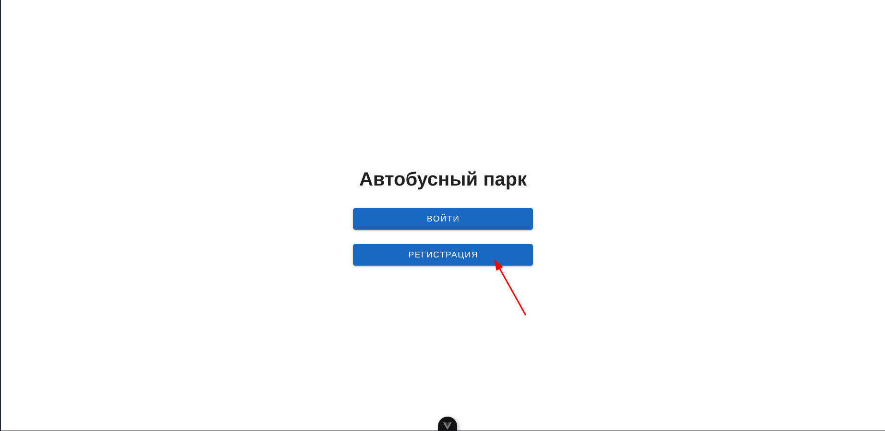

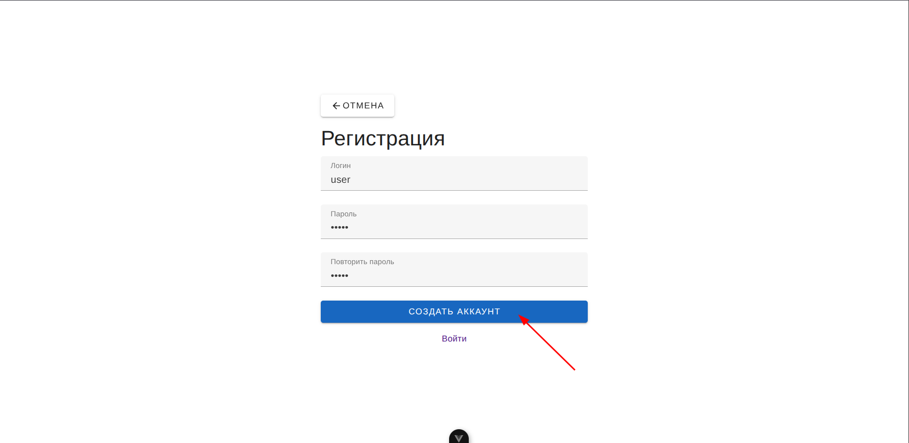

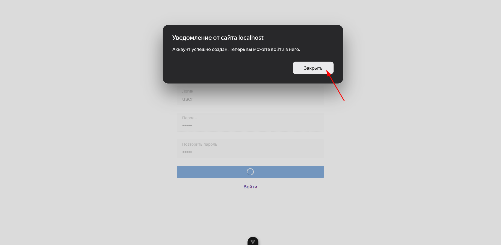

При входе по логину и паролю пользователь будет перенаправлен на страницу главного меню.

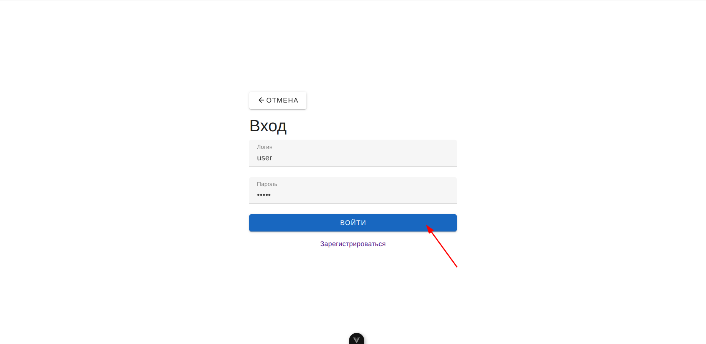

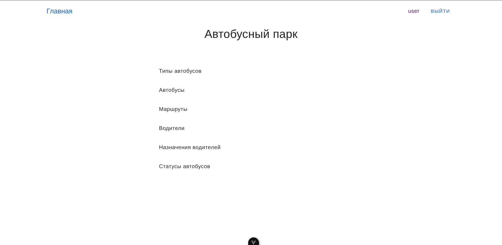

В главном меню расположены все типы объекты, с которыми можно работать в рамках клиента. С каждым типом объекта можно проводить следующие операции:

- Посмотреть список всех объектов данного типа с краткими названиями.
- Вывести все поля конкретного объекта.
- Добавить объект.
- Изменить объект.
- Удалить объект.

Клиент работает с сервером через API.

### Просмотр списка объектов и полей конкретного объекта

### Добавление нового объекта

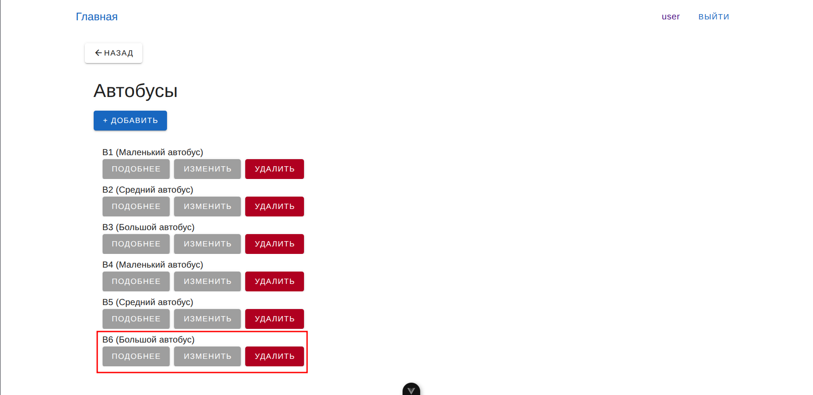

### Изменение объекта

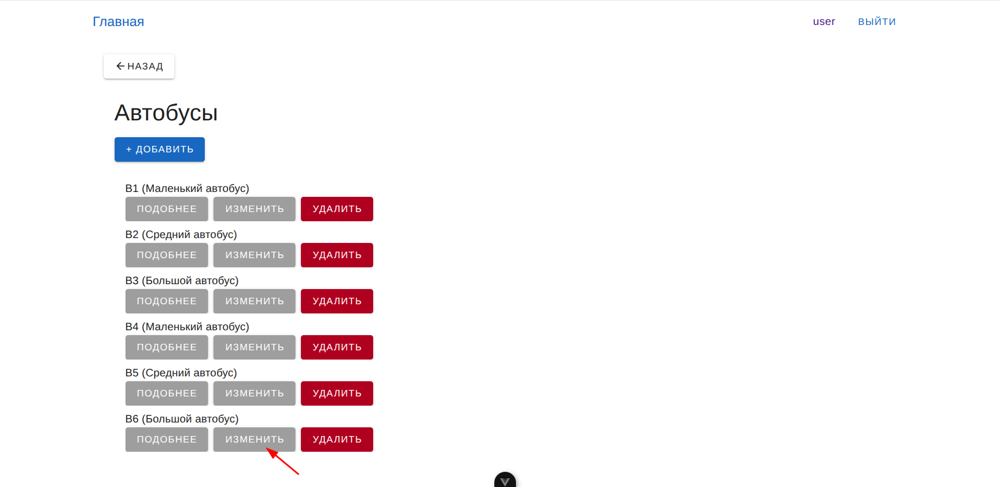

### Удаление объекта

### Профиль пользователя

Также клиент даёт возможность просматривать и изменять данные профиля пользователя (логин и пароль), а также удалить профиль пользователя при необходимости.

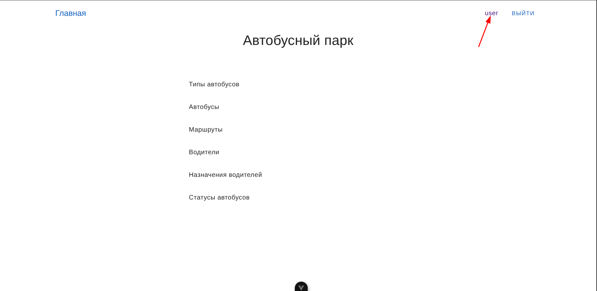

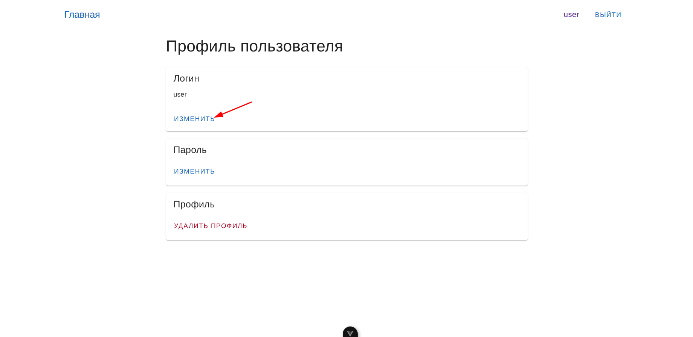

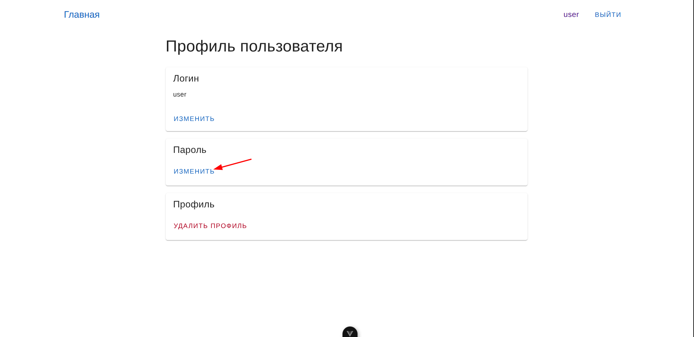

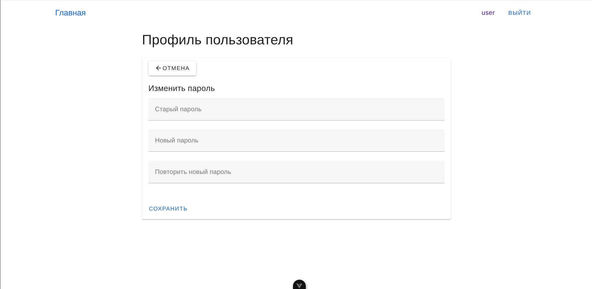

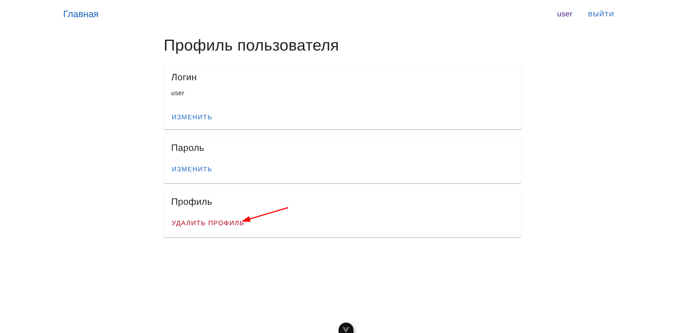

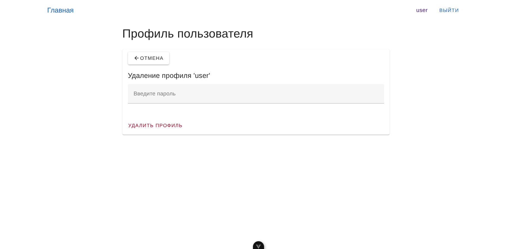

Также в хедере есть кнопка выхода из профиля.

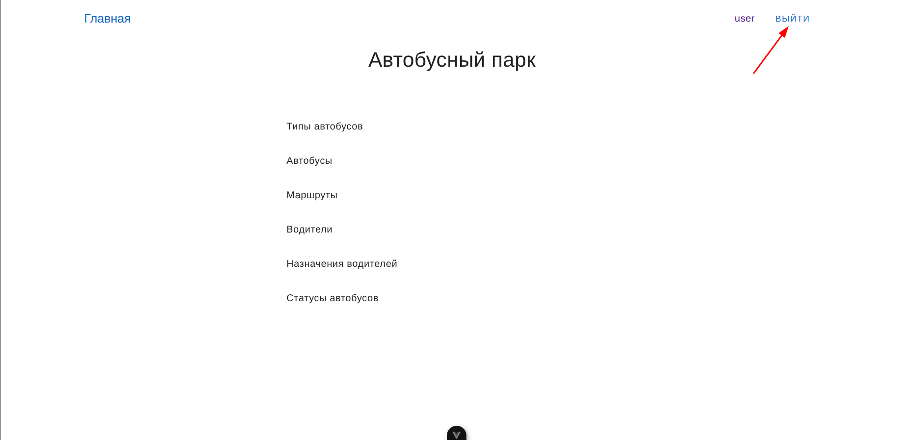

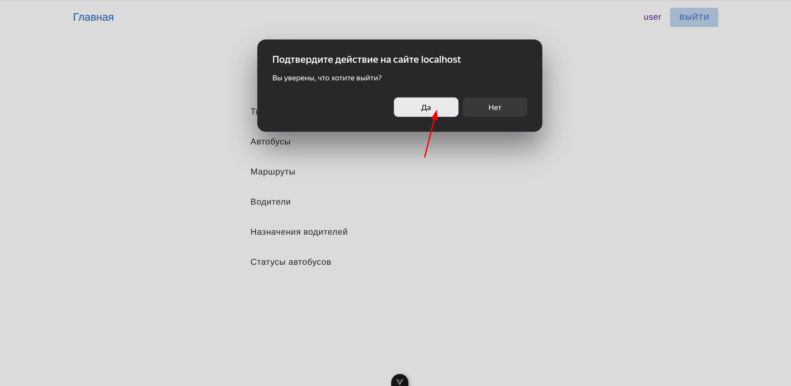

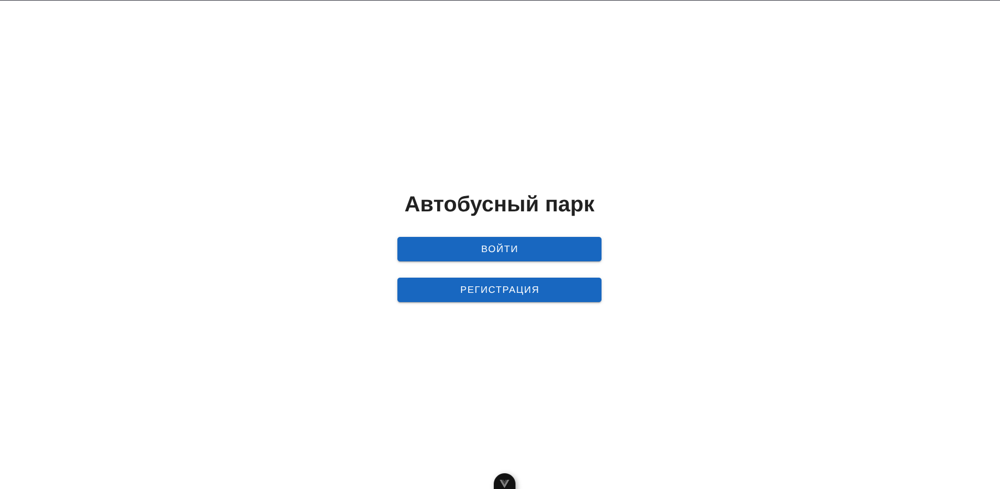
